---
## Front matter
lang: ru-RU
title: Лабораторная работа 6
subtitle: Основы интерфейса взаимодействия пользователя с системой Unix на уровне командной строки
author:
  - Мочалкина Софья Васильевна 
institute:
  - Российский университет дружбы народов, Москва, Россия

date: 22/03/2025

## i18n babel
babel-lang: russian
babel-otherlangs: english

## Formatting pdf
toc: false
toc-title: Содержание
slide_level: 2
aspectratio: 169
section-titles: true
theme: metropolis
header-includes:
 - \metroset{progressbar=frametitle,sectionpage=progressbar,numbering=fraction}
---

# Информация

## Докладчик

:::::::::::::: {.columns align=center}
::: {.column width="70%"}

  * Мочалкина Софья Васильвна
  * Студентка 1 курста НБИбд-02-24
  * Российский университет дружбы народов

:::
::: {.column width="30%"}

:::
::::::::::::::

## Цели и задачи

Приобретение практических навыков взаимодействия с системой посредством командной строки.

## Выполнение лабораторной работы 

1.1. Определяю полное имя моего домашнего каталога.(рис.1)

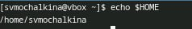{#fig:001 width=100%}

##2.1. Перехожу в каталог /tmp (рис.2)

{#fig:001 width=100%}

##2.2 Вывожу на экран содержимое каталога  /tmp используя ls с различными функциями. (рис.3-4)

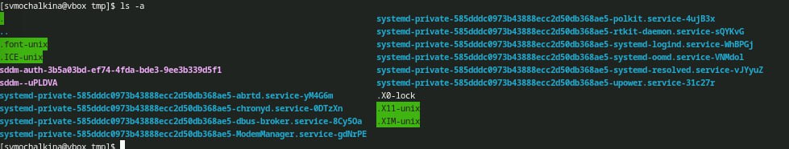{#fig:001 width=100%}

{#fig:001 width=100%}

##2.3. Определяю, есть ли в каталоге /var/spool подкаталог с именем cron.(рис.5)

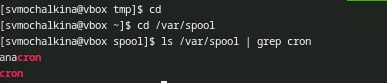{#fig:001 width=100%}

Вывожу содержимое домашнего каталога с помощь ls -alF. Владельцем файлов и подкаталогов является svmochalkina.(рис.6)

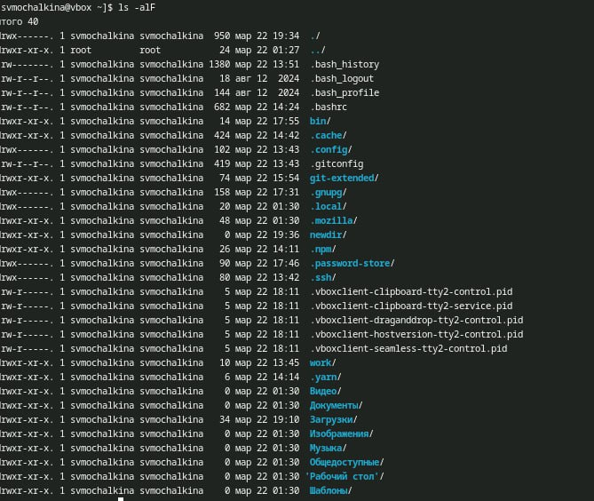{#fig:001 width=100%}

##3.1 В домашнем каталоге создаю новый каталог и именем newdir. (рис.7-8)

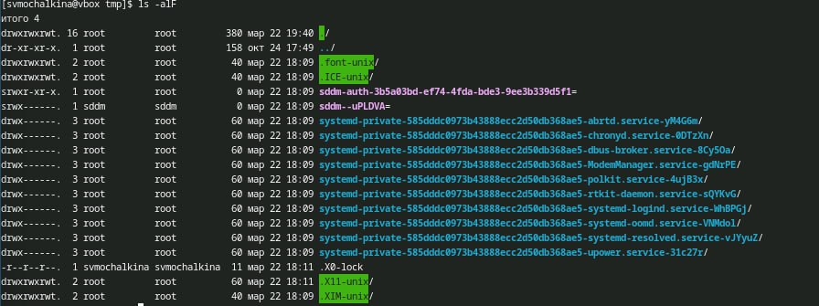{#fig:001 width=100%}

{#fig:001 width=100%}

##3.2. В этом каталоге создаю каталог morefun.(рис.9-10)

{#fig:001 width=100%}

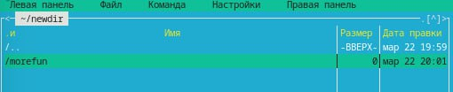{#fig:001 width=100%}

##3.3. В домашнем каталоге создаю одном командой три новых каталога с именами letters, memos, misk. Затем удаляю эти каталоги одной командой. (рис. 11-14)

{#fig:001 width=100%}

{#fig:001 width=100%}

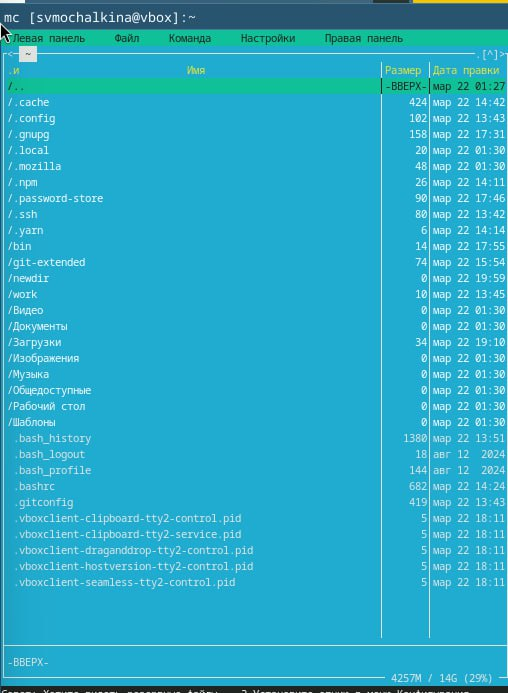{#fig:001 width=100%}

{#fig:001 width=100%}

##3.4.Пробую удалить каталог ~/newdir.(рис.15) 

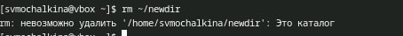{#fig:001 width=100%}

##3.5. Пробую удалить их с помощью команды rmdir.Затем удаляю каталоги(16-18)

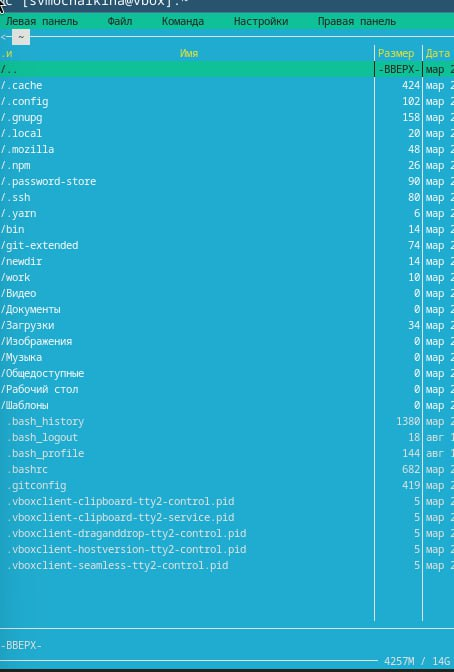{#fig:001 width=100%}

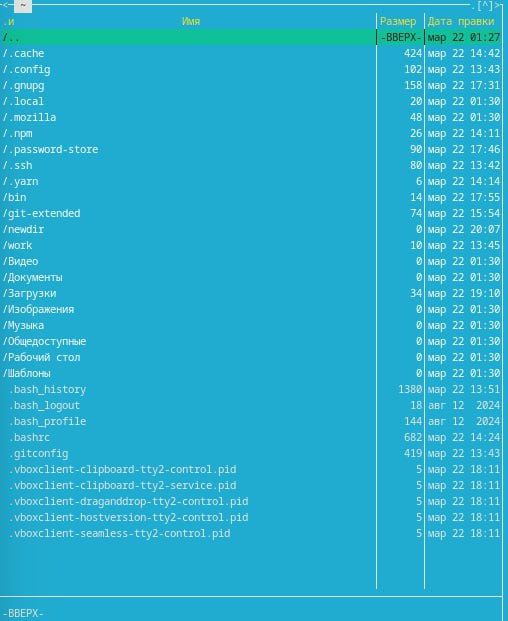{#fig:001 width=100%}

##4.1.С помощью команды man определяю, что опцию -t команды ls нужно использо-
вать для просмотра содержимое не только указанного каталога, но и подкаталогов,
входящих в него.(рис.19)

{#fig:001 width=100%}

##5.1. С помощью команды man определяю, что ls -R, позволяет отсорти-
ровать по времени последнего изменения выводимый список содержимого каталога
с развёрнутым описанием файлов.

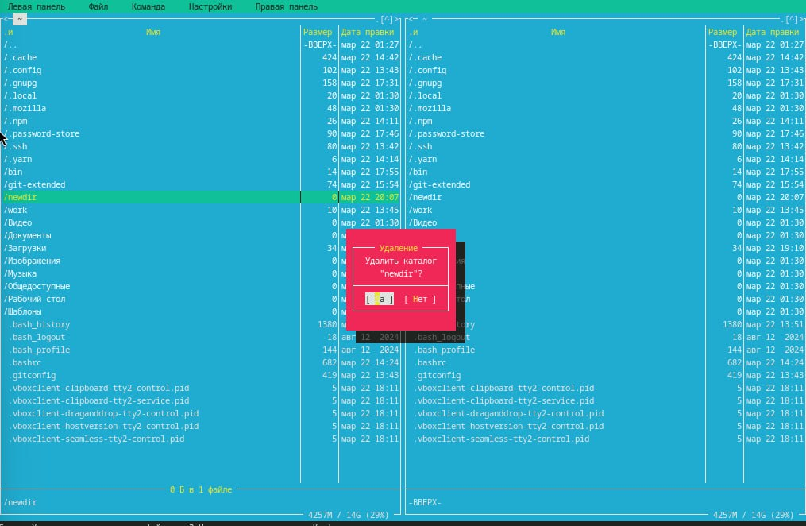{#fig:001 width=100%}

##6.1. Использую команду man для просмотра описания следующих команд: cd, pwd, mkdir,
rmdir, rm.  cd - изменение каталога, mkdir - создание каталогов, rmdir - удаление пустых каталогов,  rm - удаление файлов или каталогов.(рис. 21-30)

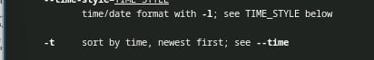{#fig:001 width=100%}

{#fig:001 width=100%}
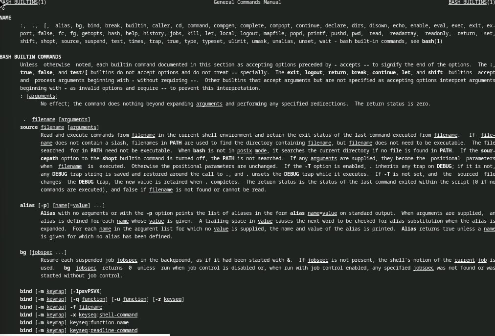{#fig:001 width=100%}

{#fig:001 width=100%}
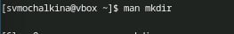{#fig:001 width=100%}

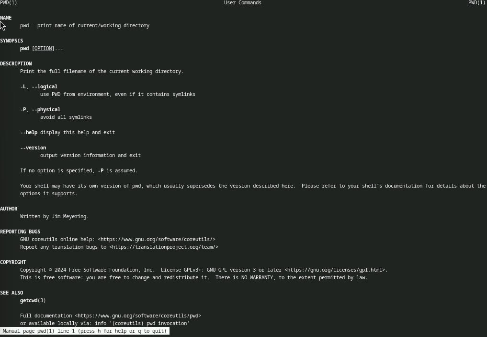{#fig:001 width=100%}
{#fig:001 width=100%}

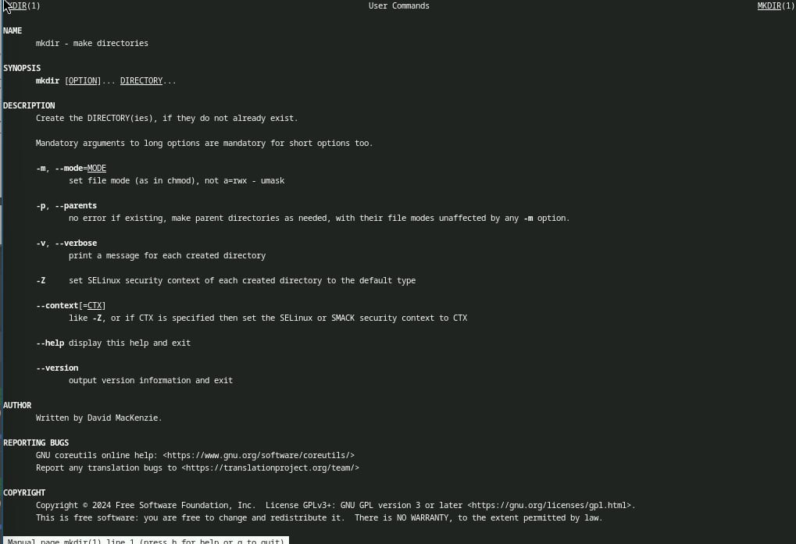{#fig:001 width=100%}
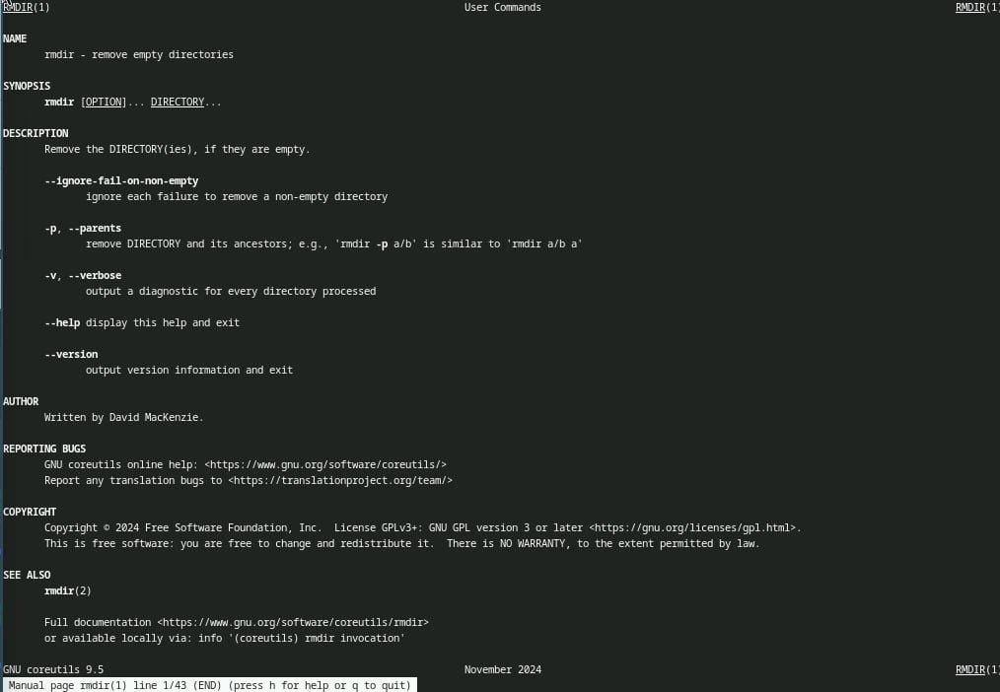{#fig:001 width=100%}

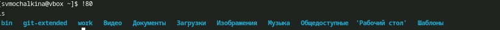{#fig:001 width=100%}

# Результаты

Я приобрела навыки взаимодействия пользователя с системой посредством командной строки.

## Представление данных

::: incremental

:::

