---
## Front matter
title: "Лабораторная работа 6"
subtitle: "Основы интерфейса взаимодействия пользователя с системой Unix на уровне командной строки"
author: "Мочалкина Софья Васильевна"

## Generic otions
lang: ru-RU
toc-title: "Содержание"

## Bibliography
bibliography: bib/cite.bib
csl: pandoc/csl/gost-r-7-0-5-2008-numeric.csl

## Pdf output format
toc: true # Table of contents
toc-depth: 2
lof: true # List of figures
lot: true # List of tables
fontsize: 12pt
linestretch: 1.5
papersize: a4
documentclass: scrreprt
## I18n polyglossia
polyglossia-lang:
  name: russian
  options:
	- spelling=modern
	- babelshorthands=true
polyglossia-otherlangs:
  name: english
## I18n babel
babel-lang: russian
babel-otherlangs: english
## Fonts
mainfont: IBM Plex Serif
romanfont: IBM Plex Serif
sansfont: IBM Plex Sans
monofont: IBM Plex Mono
mathfont: STIX Two Math
mainfontoptions: Ligatures=Common,Ligatures=TeX,Scale=0.94
romanfontoptions: Ligatures=Common,Ligatures=TeX,Scale=0.94
sansfontoptions: Ligatures=Common,Ligatures=TeX,Scale=MatchLowercase,Scale=0.94
monofontoptions: Scale=MatchLowercase,Scale=0.94,FakeStretch=0.9
mathfontoptions:
## Biblatex
biblatex: true
biblio-style: "gost-numeric"
biblatexoptions:
  - parentracker=true
  - backend=biber
  - hyperref=auto
  - language=auto
  - autolang=other*
  - citestyle=gost-numeric
## Pandoc-crossref LaTeX customization
figureTitle: "Рис."
tableTitle: "Таблица"
listingTitle: "Листинг"
lofTitle: "Список иллюстраций"
lotTitle: "Список таблиц"
lolTitle: "Листинги"
## Misc options
indent: true
header-includes:
  - \usepackage{indentfirst}
  - \usepackage{float} # keep figures where there are in the text
  - \floatplacement{figure}{H} # keep figures where there are in the text
---

# Цель работы

Приобретение практических навыков взаимодействия с системой посредством командной строки.

# Выполнение лабораторной работы

1.1. Определяю полное имя моего домашнего каталога.(рис.1)

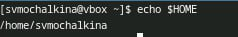{#fig:001 width=100%}

2.1. Перехожу в каталог /tmp (рис.2)

{#fig:001 width=100%}

2.2 Вывожу на экран содержимое каталога  /tmp используя ls с различными функциями. (рис.3-4)

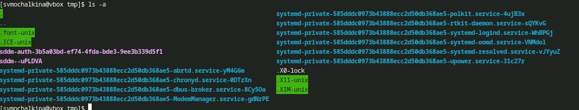{#fig:001 width=100%}

{#fig:001 width=100%}

2.3. Определяю, есть ли в каталоге /var/spool подкаталог с именем cron.(рис.5)

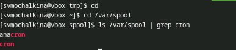{#fig:001 width=100%}

Вывожу содержимое домашнего каталога с помощь ls -alF. Владельцем файлов и подкаталогов является svmochalkina.(рис.6)

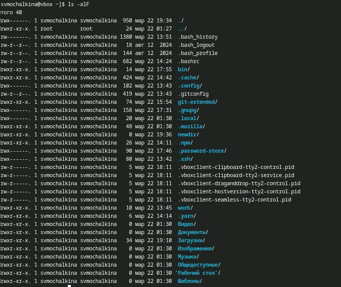{#fig:001 width=100%}

3.1 В домашнем каталоге создаю новый каталог и именем newdir. (рис.7-8)

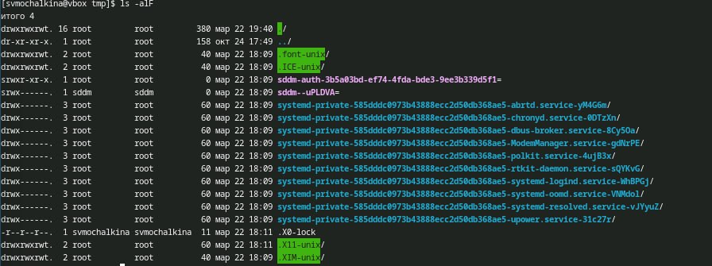{#fig:001 width=100%}

{#fig:001 width=100%}

3.2. В этом каталоге создаю каталог morefun.(рис.9-10)

{#fig:001 width=100%}

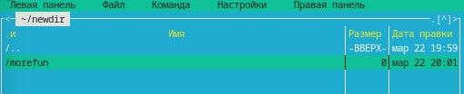{#fig:001 width=100%}

3.3. В домашнем каталоге создаю одном командой три новых каталога с именами letters, memos, misk. Затем удаляю эти каталоги одной командой. (рис. 11-14)

{#fig:001 width=100%}

{#fig:001 width=100%}

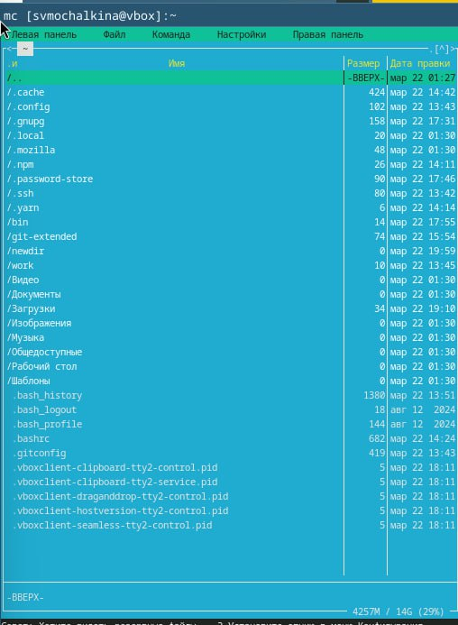{#fig:001 width=100%}

{#fig:001 width=100%}

3.4.Пробую удалить каталог ~/newdir.(рис.15) 

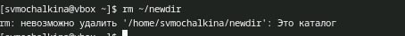{#fig:001 width=100%}

3.5. Пробую удалить их с помощью команды rmdir.Затем удаляю каталоги(16-18)

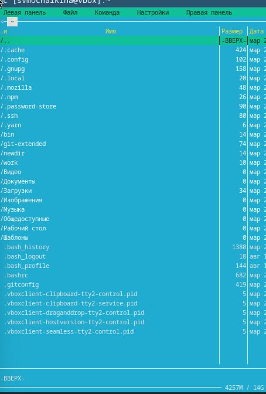{#fig:001 width=100%}

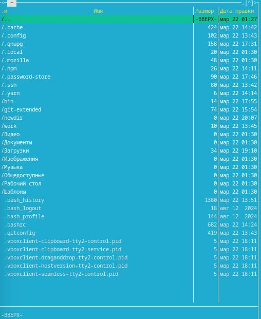{#fig:001 width=100%}

4.1.С помощью команды man определяю, что опцию -t команды ls нужно использо-
вать для просмотра содержимое не только указанного каталога, но и подкаталогов,
входящих в него.(рис.19)

{#fig:001 width=100%}

5.1. С помощью команды man определяю, что ls -R, позволяет отсорти-
ровать по времени последнего изменения выводимый список содержимого каталога
с развёрнутым описанием файлов.

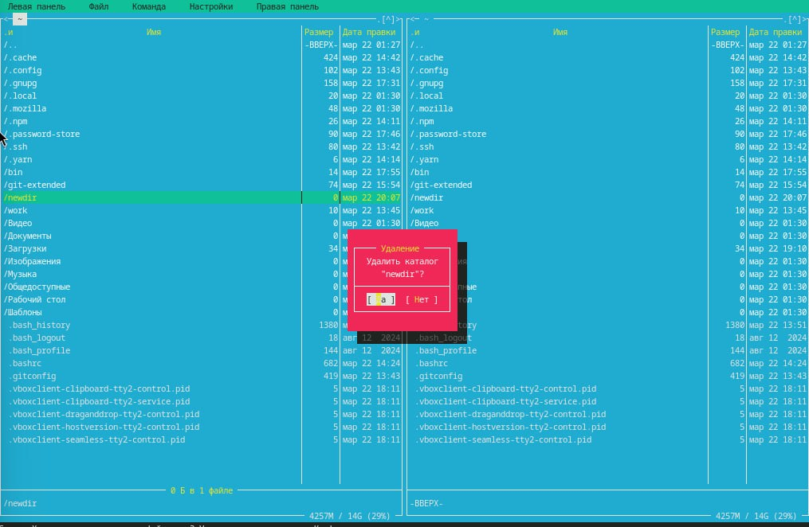{#fig:001 width=100%}

6.1. Использую команду man для просмотра описания следующих команд: cd, pwd, mkdir,
rmdir, rm.  cd - изменение каталога, mkdir - создание каталогов, rmdir - удаление пустых каталогов,  rm - удаление файлов или каталогов.(рис. 21-30)

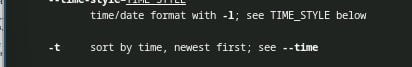{#fig:001 width=100%}

{#fig:001 width=100%}
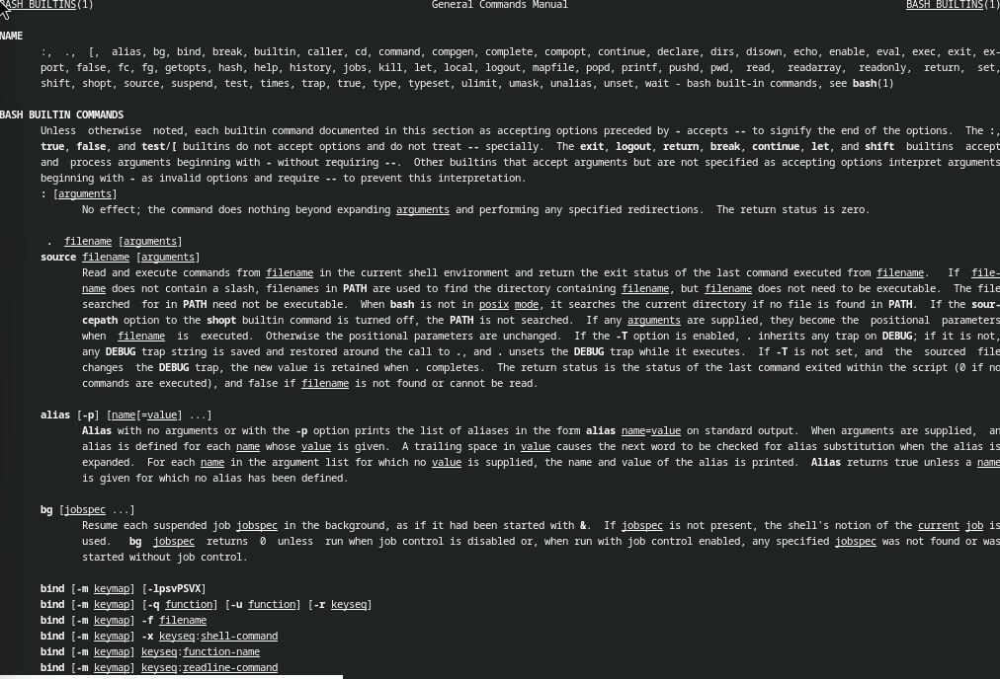{#fig:001 width=100%}

{#fig:001 width=100%}
{#fig:001 width=100%}

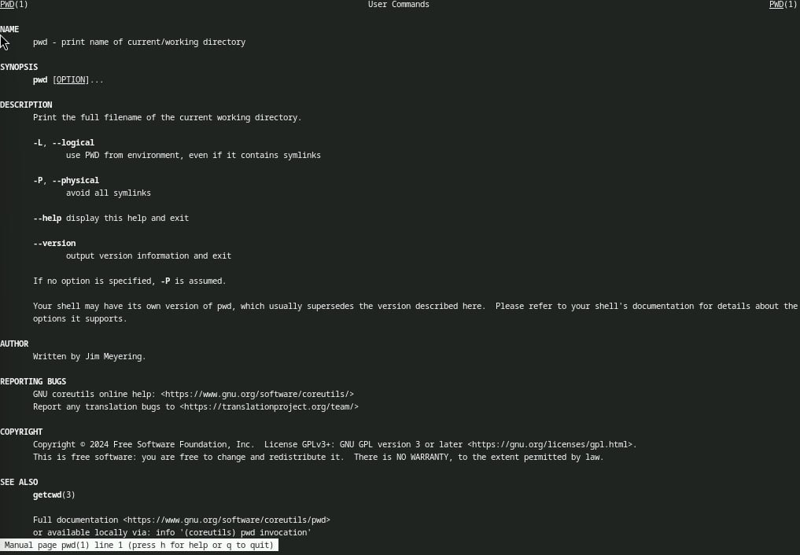{#fig:001 width=100%}
{#fig:001 width=100%}

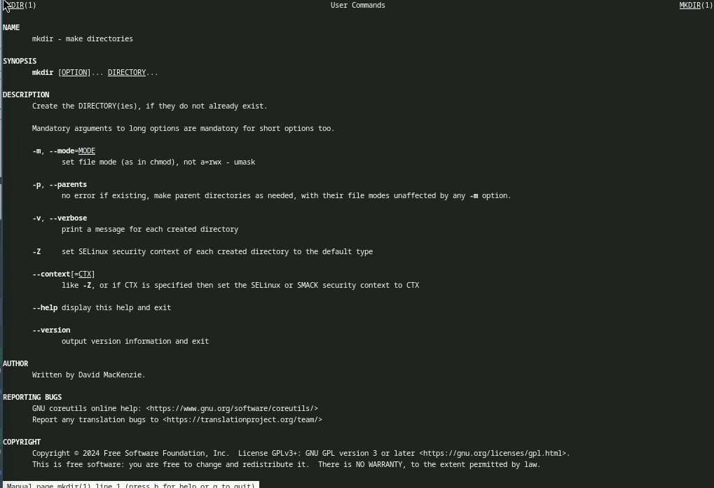{#fig:001 width=100%}
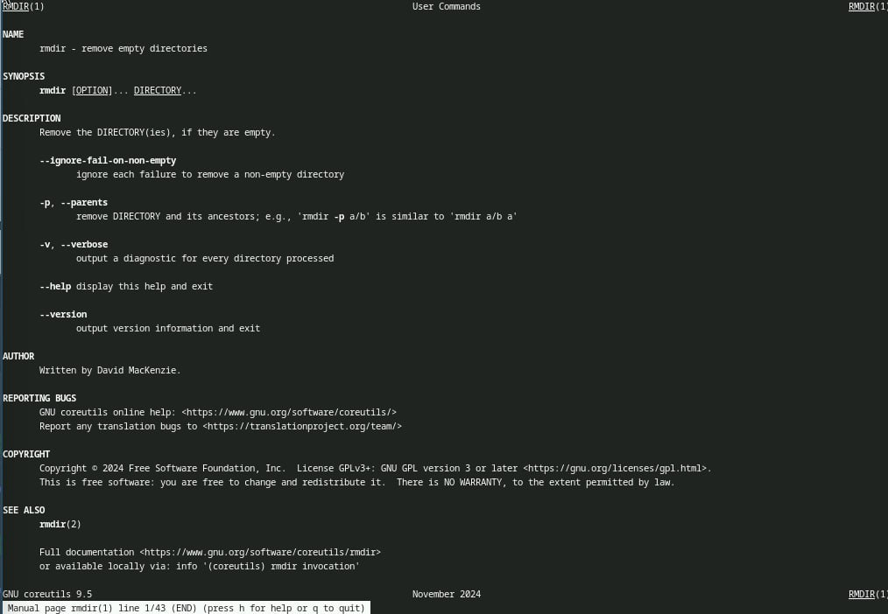{#fig:001 width=100%}

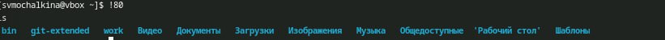{#fig:001 width=100%}

7.1. Используя информацию, полученную при помощи команды history, выполняю мо-
дификацию и исполнение нескольких команд из буфера команд.

{#fig:001 width=100%}

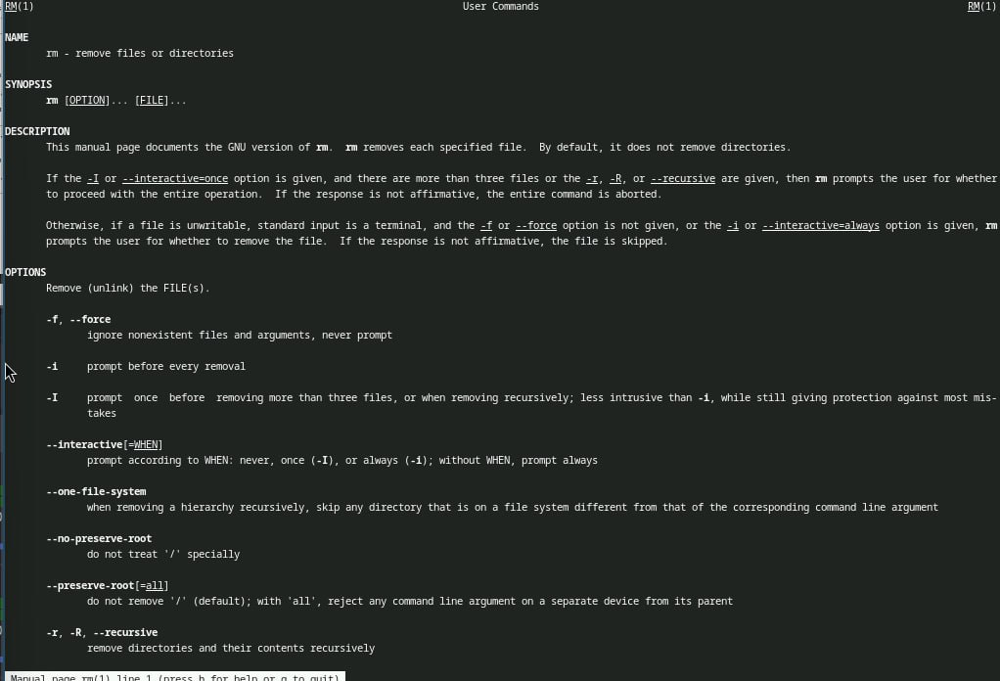{#fig:001 width=100%}
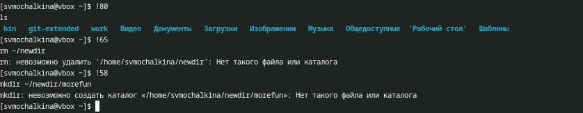{#fig:001 width=100%}
{#fig:001 width=100%}
{#fig:001 width=100%}
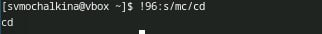{#fig:001 width=100%}

# Выводы

Я приобрела навыки взаимодействия пользователя с системой посредством командной трокиййq.

# Список литературы{.unnumbered}

::: {#refs}
:::
