---
## Front matter
lang: ru-RU
title: "Лабораторная работа 7"
subtitle: "Анализ файловой системы Linux.
Команды для работы с файлами и каталогами"
author: "Мочалкина Софья Васильевна"

## i18n babel
babel-lang: russian
babel-otherlangs: english

## Formatting pdf
toc: false
toc-title: Содержание
slide_level: 2
aspectratio: 169
section-titles: true
theme: metropolis
header-includes:
 - \metroset{progressbar=frametitle,sectionpage=progressbar,numbering=fraction}
---

# Информация

## Цели и задачи

Ознакомление с файловой системой Linux, её структурой, именами и содержанием
каталогов. Приобретение практических навыков по применению команд для работы
с файлами и каталогами, по управлению процессами (и работами), по проверке исполь-
зования диска и обслуживанию файловой системы.

## Примеры 

Выполнение примеров: 

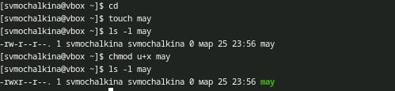{#fig:001 width=100%}

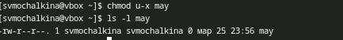{#fig:001 width=100%}

{#fig:001 width=100%}

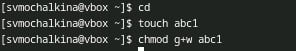{#fig:001 width=100%}

## Копирую файл /usr/include/sys/io.h в домашний каталог и называю его
equipment.

{#fig:001 width=100%}

## В домашнем каталоге создаю директорию ~/ski.plases.

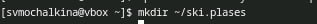{#fig:001 width=100%}

## Цели и задачи

- Создать шаблон презентации в Markdown
- Описать алгоритм создания выходных форматов презентаций

## Перемещаю файл equipment в каталог ~/ski.plases.

{#fig:001 width=100%}

## Перемещаю файл equipment в каталог ~/ski.plases.

{#fig:001 width=100%}

## Переименовываю файл ~/ski.plases/equipment в ~/ski.plases/equiplist.

{#fig:001 width=100%}

## Создаю в домашнем каталоге файл abc1 и копирую его в каталог ~/ski.plases, называю его equiplist2.

{#fig:001 width=100%}

## Создаю каталог с именем equipment в каталоге ~/ski.plases.

{#fig:001 width=100%}

## Перемещаю файлы ~/ski.plases/equiplist и equiplist2 в каталог ~/ski.plases/equipment.

{#fig:001 width=100%}

## Создаю и перемещаю каталог ~/newdir в каталог ~/ski.plases и называю его plans.

{#fig:001 width=100%}

## Определяю опции команды chmod, необходимые для того, чтобы присвоить перечисленным ниже файлам выделенные права доступа, считая, что в начале таких прав нет:

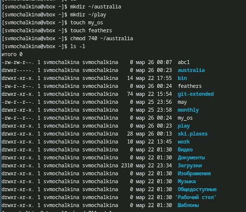{#fig:001 width=100%}
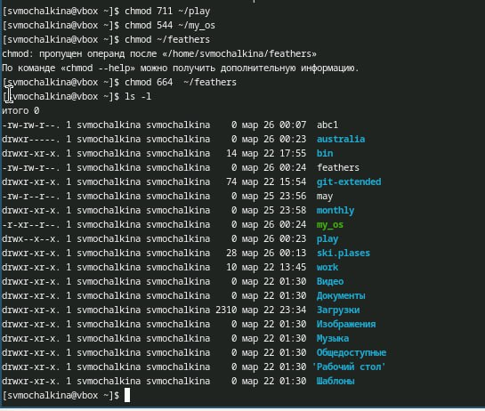{#fig:001 width=100%}

## Просмотрите содержимое файла /etc/password.

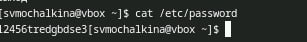{#fig:001 width=100%}

## Копирую файл ~/feathers в файл ~/file.old.

{#fig:001 width=100%}

## Перемещаю файл ~/file.old в каталог ~/play.

{#fig:001 width=100%}

## Копирую каталог ~/play в каталог ~/fun.

{#fig:001 width=100%}

## Перемещаю каталог ~/fun в каталог ~/play и называю его games.

{#fig:001 width=100%}

## Лишаю владельца файла ~/feathers права на чтение.

{#fig:001 width=100%}

## Если я попытаюсь просмотреть файл ~/feathers командой cat, будет:

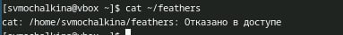{#fig:001 width=100%}

## Если я попытаюсь скопировать файл ~/feathers, будет:

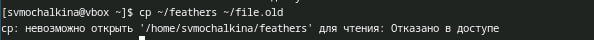{#fig:001 width=100%}

## Даю владельцу файла ~/feathers право на чтение.

{#fig:001 width=100%}

## Лишаю владельца каталога ~/play права на выполнение.

{#fig:001 width=100%}

## Перехожу в каталог ~/play:

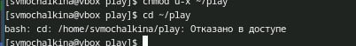{#fig:001 width=100%}

## Даю владельцу каталога ~/play право на выполнение.

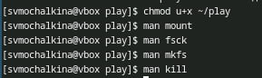{#fig:001 width=100%}

## Читаю man по командам mount, fsck, mkfs, kill. 

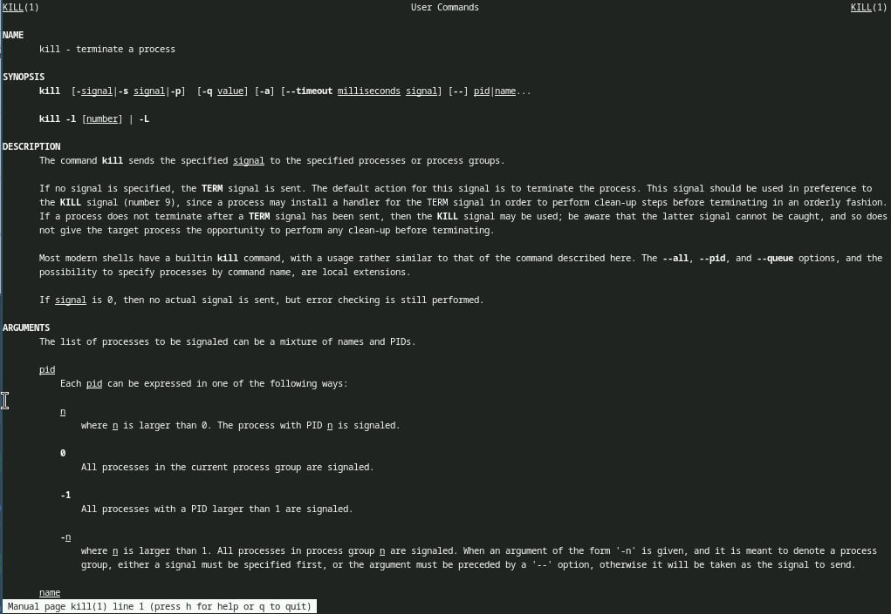{#fig:001 width=100%}
{#fig:001 width=100%}

## Результаты

Я ознакомилась с файловой системой Linux, её структурой, именами и содержанием каталогов. Приобрела практические навыки по применению команд для работы с файлами и каталогами, по управлению процессами (и работами), по проверке использования диска и обслуживанию файловой системы.

