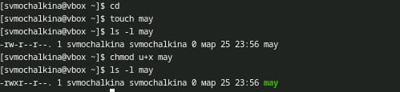
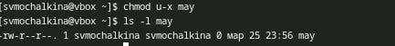
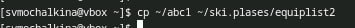
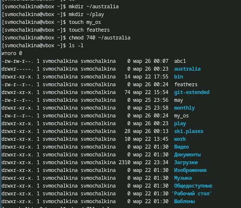
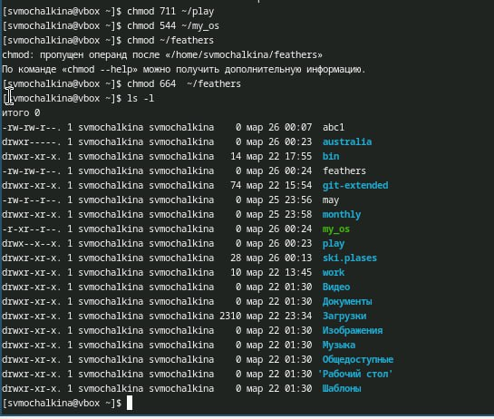
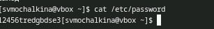
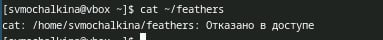
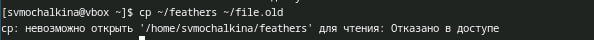
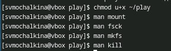
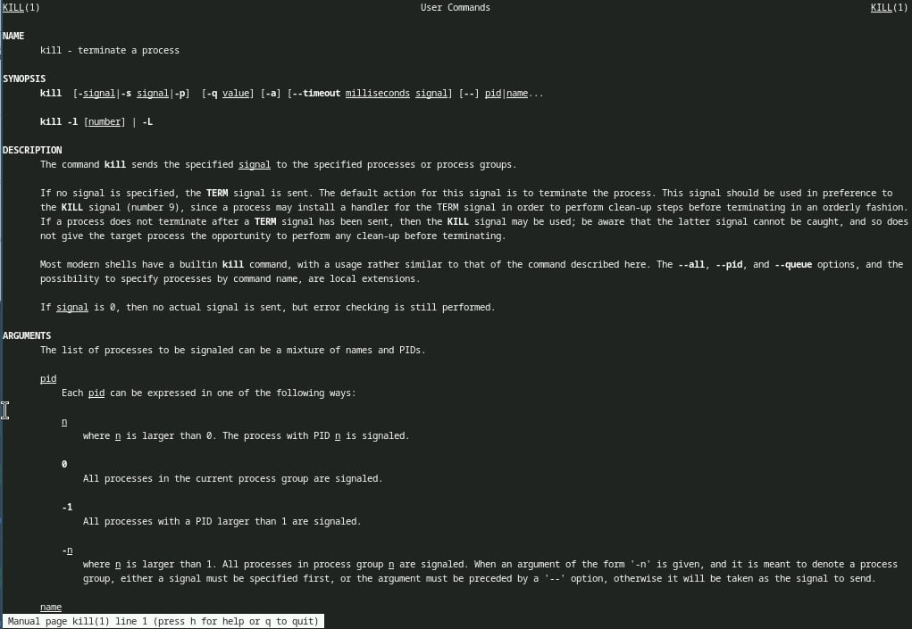

---
## Front matter
title: "Лабораторная работа 7"
subtitle: "Анализ файловой системы Linux.
Команды для работы с файлами и каталогами"
author: "Мочалкина Софья Васильевна "

## Generic otions
lang: ru-RU
toc-title: "Содержание"

## Bibliography
bibliography: bib/cite.bib
csl: pandoc/csl/gost-r-7-0-5-2008-numeric.csl

## Pdf output format
toc: true # Table of contents
toc-depth: 2
lof: true # List of figures
lot: true # List of tables
fontsize: 12pt
linestretch: 1.5
papersize: a4
documentclass: scrreprt
## I18n polyglossia
polyglossia-lang:
  name: russian
  options:
	- spelling=modern
	- babelshorthands=true
polyglossia-otherlangs:
  name: english
## I18n babel
babel-lang: russian
babel-otherlangs: english
## Fonts
mainfont: IBM Plex Serif
romanfont: IBM Plex Serif
sansfont: IBM Plex Sans
monofont: IBM Plex Mono
mathfont: STIX Two Math
mainfontoptions: Ligatures=Common,Ligatures=TeX,Scale=0.94
romanfontoptions: Ligatures=Common,Ligatures=TeX,Scale=0.94
sansfontoptions: Ligatures=Common,Ligatures=TeX,Scale=MatchLowercase,Scale=0.94
monofontoptions: Scale=MatchLowercase,Scale=0.94,FakeStretch=0.9
mathfontoptions:
## Biblatex
biblatex: true
biblio-style: "gost-numeric"
biblatexoptions:
  - parentracker=true
  - backend=biber
  - hyperref=auto
  - language=auto
  - autolang=other*
  - citestyle=gost-numeric
## Pandoc-crossref LaTeX customization
figureTitle: "Рис."
tableTitle: "Таблица"
listingTitle: "Листинг"
lofTitle: "Список иллюстраций"
lotTitle: "Список таблиц"
lolTitle: "Листинги"
## Misc options
indent: true
header-includes:
  - \usepackage{indentfirst}
  - \usepackage{float} # keep figures where there are in the text
  - \floatplacement{figure}{H} # keep figures where there are in the text
---

# Цель работы

Ознакомление с файловой системой Linux, её структурой, именами и содержанием
каталогов. Приобретение практических навыков по применению команд для работы
с файлами и каталогами, по управлению процессами (и работами), по проверке исполь-
зования диска и обслуживанию файловой системы.

# Задание

1 Выполните все примеры, приведённые в первой части описания лабораторной работы.
2 Выполните следующие действия, зафиксировав в отчёте по лабораторной работе
используемые при этом команды и результаты их выполнения:
2.1. Скопируйте файл /usr/include/sys/io.h в домашний каталог и назовите его
equipment. Если файла io.h нет, то используйте любой другой файл в каталоге
/usr/include/sys/ вместо него.
2.2. В домашнем каталоге создайте директорию ~/ski.plases.
2.3. Переместите файл equipment в каталог ~/ski.plases.
2.4. Переименуйте файл ~/ski.plases/equipment в ~/ski.plases/equiplist.
2.5. Создайте в домашнем каталоге файл abc1 и скопируйте его в каталог
~/ski.plases, назовите его equiplist2.
2.6. Создайте каталог с именем equipment в каталоге ~/ski.plases.
2.7. Переместите файлы ~/ski.plases/equiplist и equiplist2 в каталог
~/ski.plases/equipment.
2.8. Создайте и переместите каталог ~/newdir в каталог ~/ski.plases и назовите
его plans.
Кулябов Д. С. и др. Операционные системы 53
3 Определите опции команды chmod, необходимые для того, чтобы присвоить перечис-
ленным ниже файлам выделенные права доступа, считая, что в начале таких прав
нет:
3.1. drwxr--r-- ... australia
3.2. drwx--x--x ... play
3.3. -r-xr--r-- ... my_os
3.4. -rw-rw-r-- ... feathers
При необходимости создайте нужные файлы.
4 Проделайте приведённые ниже упражнения, записывая в отчёт по лабораторной
работе используемые при этом команды:
4.1. Просмотрите содержимое файла /etc/password.
4.2. Скопируйте файл ~/feathers в файл ~/file.old.
4.3. Переместите файл ~/file.old в каталог ~/play.
4.4. Скопируйте каталог ~/play в каталог ~/fun.
4.5. Переместите каталог ~/fun в каталог ~/play и назовите его games.
4.6. Лишите владельца файла ~/feathers права на чтение.
4.7. Что произойдёт, если вы попытаетесь просмотреть файл ~/feathers командой
cat?
4.8. Что произойдёт, если вы попытаетесь скопировать файл ~/feathers?
4.9. Дайте владельцу файла ~/feathers право на чтение.
4.10. Лишите владельца каталога ~/play права на выполнение.
4.11. Перейдите в каталог ~/play. Что произошло?
4.12. Дайте владельцу каталога ~/play право на выполнение.
5 Прочитайте man по командам mount, fsck, mkfs, kill и кратко их охарактеризуйте,
приведя примеры.

# Теоретическое введение

Следующие клавиши используются для управления процессом просмотра:
– Space — переход к следующей странице,
– ENTER — сдвиг вперёд на одну строку,
– b — возврат на предыдущую страницу,
– h — обращение за подсказкой,
– q — выход из режима просмотра файла.

# Выполнение лабораторной работы

1) Выполняю все примеры, приведённые в первой части описания лабораторной работы.

{#fig:001 width=100%}
{#fig:001 width=100%}
{#fig:001 width=100%}
{#fig:001 width=100%}

2) Выполняю следующие действия:
2.1. Копирую файл /usr/include/sys/io.h в домашний каталог и называю его
equipment.

{#fig:001 width=100%}

2.2. В домашнем каталоге создаю директорию ~/ski.plases.

{#fig:001 width=100%}

2.3. Перемещаю файл equipment в каталог ~/ski.plases.

{#fig:001 width=100%}

2.4. Переименовываю файл ~/ski.plases/equipment в ~/ski.plases/equiplist.

{#fig:001 width=100%}

2.5. Создаю в домашнем каталоге файл abc1 и копирую его в каталог
~/ski.plases, называю его equiplist2.

{#fig:001 width=100%}

2.6. Создаю каталог с именем equipment в каталоге ~/ski.plases.

{#fig:001 width=100%}

2.7. Перемещаю файлы ~/ski.plases/equiplist и equiplist2 в каталог ~/ski.plases/equipment.

{#fig:001 width=100%}

2.8. Создаю и перемещаю каталог ~/newdir в каталог ~/ski.plases и называю его plans.

{#fig:001 width=100%}

3) Определяю опции команды chmod, необходимые для того, чтобы присвоить перечисленным ниже файлам выделенные права доступа, считая, что в начале таких прав нет:
3.1. drwxr--r-- ... australia
3.2. drwx--x--x ... play
3.3. -r-xr--r-- ... my_os
3.4. -rw-rw-r-- ... feathers
До этого создаю нужные файлы.

{#fig:001 width=100%}
{#fig:001 width=100%}

4) Проделываю приведённые ниже упражнения.
работе используемые при этом команды:
4.1. Просмотрите содержимое файла /etc/password.

{#fig:001 width=100%}

4.2. Копирую файл ~/feathers в файл ~/file.old.

{#fig:001 width=100%}

4.3. Перемещаю файл ~/file.old в каталог ~/play.

{#fig:001 width=100%}

4.4. Копирую каталог ~/play в каталог ~/fun.

{#fig:001 width=100%}

4.5. Перемещаю каталог ~/fun в каталог ~/play и называю его games.

{#fig:001 width=100%}

4.6. Лишаю владельца файла ~/feathers права на чтение.

{#fig:001 width=100%}

4.7. Если я попытаюсь просмотреть файл ~/feathers командой cat, будет:

{#fig:001 width=100%}

4.8. Если я попытаюсь скопировать файл ~/feathers, будет:

{#fig:001 width=100%}

4.9. Даю владельцу файла ~/feathers право на чтение.

{#fig:001 width=100%}

4.10. Лишаю владельца каталога ~/play права на выполнение.

{#fig:001 width=100%}

4.11. Перехожу в каталог ~/play:

{#fig:001 width=100%}

4.12. Даю владельцу каталога ~/play право на выполнение.

{#fig:001 width=100%}

5) Читаю man по командам mount, fsck, mkfs, kill. 

{#fig:001 width=100%}
{#fig:001 width=100%}

Их краткая характеристика:
 - mount: Используется для монтирования файловых систем в Linux. Пример: mount /dev/sdb1 /mnt/usb монтирует USB-накопитель.

- fsck: Проверяет целостность файловой системы и исправляет ошибки. Пример: fsck /dev/sda1 проверяет файловую систему на первом разделе жесткого диска.

- mkfs: Создает файловую систему на разделе. Пример: mkfs.ext4 /dev/sda1 создает файловую систему ext4 на первом разделе жесткого диска.

- kill: Отправляет сигнал процессу, обычно используется для завершения процессов. Пример: kill -9 1234, чтобы принудительно завершить процесс с идентификатором 1234.

Ответы на контрольные вопросы:

1) Характеристика файловых систем
На жестком диске компьютера могут быть установлены различные файловые системы, такие как:

- NTFS (New Technology File System): Используется в Windows. Поддерживает большие объемы данных, надежную защиту, шифрование и журналы, что помогает восстанавливать данные после сбоев.
  
- FAT32 (File Allocation Table 32): Широко используется для флеш-накопителей и совместимости с различными системами. Ограничен размером файла до 4 ГБ и объемом раздела до 8 ТБ.
  
- ext4 (Fourth Extended File System): Популярная файловая система для Linux. Поддерживает большие объемы данных, эффективное управление пространством и высокую производительность.
  
- HFS+ (Hierarchical File System Plus): Используется в macOS. Поддерживает метаданные и позволяет работать с большими файлами.
  
- exFAT (Extended File Allocation Table): Подходит для флеш-накопителей, поддерживает большие файлы и более эффективен, чем FAT32.

2) Общая структура файловой системы
Структура файловой системы в Unix-подобных системах обычно выглядит так:

- /: Корневая директория.
  - /bin: Содержит основные исполняемые файлы.
  - /boot: Файлы загрузки системы.
  - /dev: Специальные файлы устройств.
  - /etc: Конфигурационные файлы.
  - /home: Домашние директории пользователей.
  - /lib: Библиотеки, используемые программами.
  - /media: Точки монтирования для внешних устройств.
  - /mnt: Точки монтирования для временного подключения файловых систем.
  - /opt: Дополнительные программы и пакеты.
  - /tmp: Временные файлы.
  - /usr: Пользовательские программы и данные.
  - /var: Данные, которые могут изменяться, например, логи.

3) Операция для доступа файловой системы
Чтобы содержимое файловой системы было доступно операционной системе, необходимо смонтировать файловую систему. Это можно сделать с помощью команды mount.

4) Причины нарушения целостности файловой системы
Основные причины:
- Внезапное отключение питания.
- Ошибки программного обеспечения.
- Повреждение жесткого диска.
- Вирусы и вредоносные программы.

Для устранения повреждений можно использовать утилиты, такие как fsck для Linux или chkdsk для Windows, которые проверяют и исправляют ошибки файловой системы.

5) Создание файловой системы
Файловая система создается с помощью утилит, таких как mkfs в Linux. Команда mkfs создает файловую систему на указанном разделе диска.

6) Команды для просмотра текстовых файлов
Основные команды:
- cat: Отображает содержимое файла.
- less: Позволяет просматривать содержимое файла с возможностью прокрутки.
- more: Обеспечивает постраничный просмотр файла.
- head: Показывает первые несколько строк файла.
- tail: Показывает последние несколько строк файла.

7) Возможности команды cp в Linux
Команда cp используется для копирования файлов и директорий. Основные возможности:
- cp source destination: Копирует файл.
- cp -r source_dir destination_dir: Копирует директорию рекурсивно.
- cp -i: Запрашивает подтверждение перед перезаписью.
- cp -u: Копирует только те файлы, которые новее, чем существующие.

8) Возможности команды mv в Linux
Команда mv используется для перемещения и переименования файлов и директорий. Основные возможности:
- mv source destination: Перемещает файл или директорию.
- mv oldname newname: Переименовывает файл или директорию.
- mv -i: Запрашивает подтверждение перед перезаписью.

9) Права доступа
Права доступа определяют, кто может читать, записывать или выполнять файлы. В Linux есть три типа прав:
- r (read): Чтение.
- w (write): Запись.
- x (execute): Выполнение.

Права могут быть изменены с помощью команды chmod. Например, chmod +x filename добавляет право

# Выводы

Я ознакомилась с файловой системой Linux, её структурой, именами и содержанием каталогов. Приобрела практические навыки по применению команд для работы с файлами и каталогами, по управлению процессами (и работами), по проверке использования диска и обслуживанию файловой системы.

# Список литературы{.unnumbered}

