---
## Front matter
lang: ru-RU
title: Лабораторная работа 8
subtitle: Поиск файлов. Перенаправление
ввода-вывода. Просмотр запущенных процессов
author:
  - Мочалкина С. В.
institute:
  - Российский университет дружбы народов, Москва, Россия
date: 04 апреля 2025

## i18n babel
babel-lang: russian
babel-otherlangs: english

## Formatting pdf
toc: false
toc-title: Содержание
slide_level: 2
aspectratio: 169
section-titles: true
theme: metropolis
header-includes:
 - \metroset{progressbar=frametitle,sectionpage=progressbar,numbering=fraction}
---

## Цель работы

Ознакомление с инструментами поиска файлов и фильтрации текстовых данных.
Приобретение практических навыков: по управлению процессами (и заданиями), по
проверке использования диска и обслуживанию файловых систем.

## Задание

1) Осуществите вход в систему, используя соответствующее имя пользователя.
2) Запишите в файл file.txt названия файлов, содержащихся в каталоге /etc. Допи-
шите в этот же файл названия файлов, содержащихся в вашем домашнем каталоге.
3) Выведите имена всех файлов из file.txt, имеющих расширение .conf, после чего
запишите их в новый текстовой файл conf.txt.

## Задание

4) Определите, какие файлы в вашем домашнем каталоге имеют имена, начинавшиеся
с символа c? Предложите несколько вариантов, как это сделать.
5) Выведите на экран (по странично) имена файлов из каталога /etc, начинающиеся
с символа h.
6) Запустите в фоновом режиме процесс, который будет записывать в файл ~/logfile
файлы, имена которых начинаются с log.

## Задание

7) Удалите файл ~/logfile.
8) Запустите из консоли в фоновом режиме редактор gedit.
9) Определите идентификатор процесса gedit, используя команду ps, конвейер и фильтр
grep. Как ещё можно определить идентификатор процесса?

## Задание

10) Прочтите справку (man) команды kill, после чего используйте её для завершения
процесса gedit.
11) Выполните команды df и du, предварительно получив более подробную информацию
об этих командах, с помощью команды man.
12) Воспользовавшись справкой команды find, выведите имена всех директорий, имею-
щихся в вашем домашнем каталоге.

# Выполнение лабораторной работы

## Записываю в файл file.txt названия файлов, содержащихся в каталоге /etc. Дописываю в этот же файл названия файлов, содержащихся в домашнем каталоге.

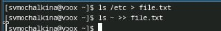

## Вывожу имена всех файлов из file.txt, имеющих расширение .conf, после чего записываю их в новый текстовой файл conf.txt.

## Определяю, какие файлы в домашнем каталоге имеют имена, начинавшиеся с символа c. 

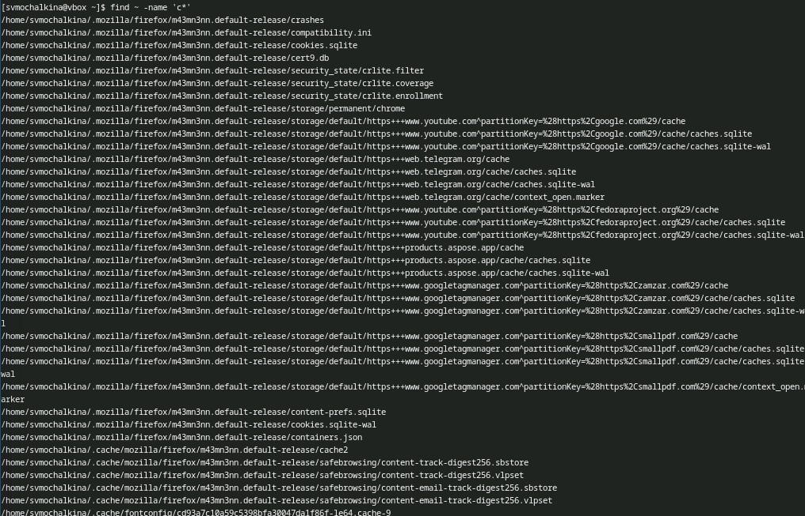

## Вывожу на экран (по странично) имена файлов из каталога /etc, начинающиеся с символа h.

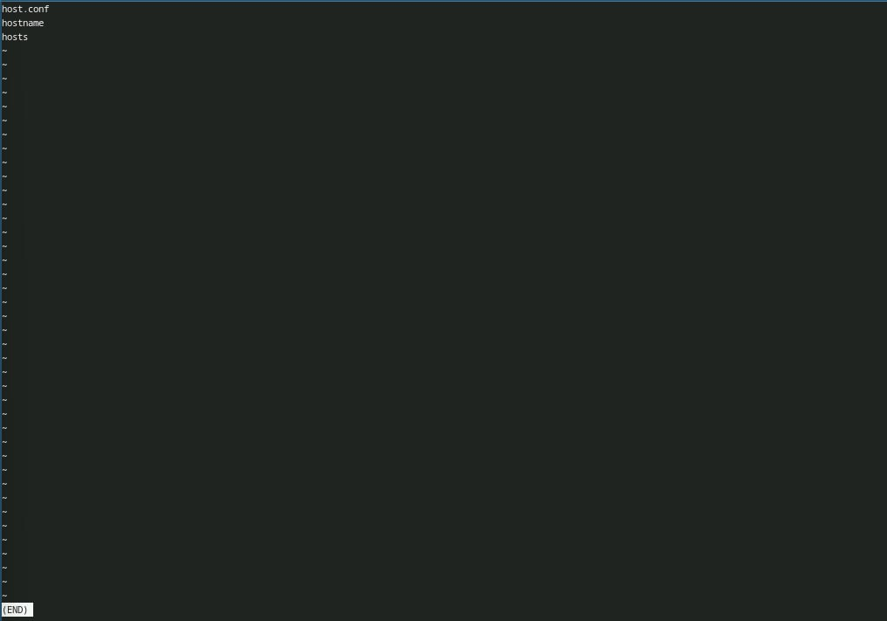

## Запускаю в фоновом режиме процесс, который будет записывать в файл ~/logfile файлы, имена которых начинаются с log.

## Удаляю файл ~/logfile.

## Запускаю из консоли в фоновом режиме редактор gedit.

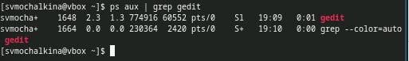

## Определяю идентификатор процесса gedit, используя команду ps, конвейер и фильтр grep. Можно также использовать pgrep gedit.

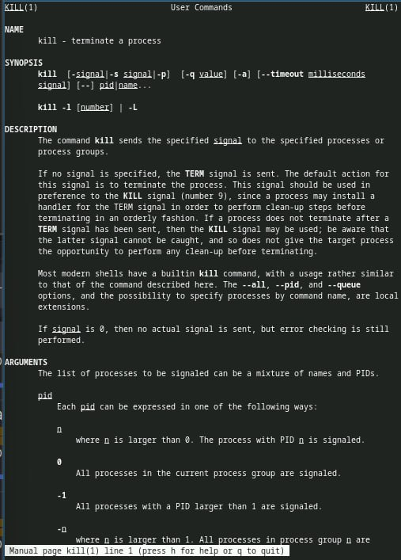

## Читаю справку (man) команды kill, после чего использую её для завершения процесса gedit.

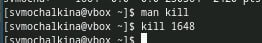

## Выполняю команды df и du, предварительно получив более подробную информацию об этих командах, с помощью команды man.

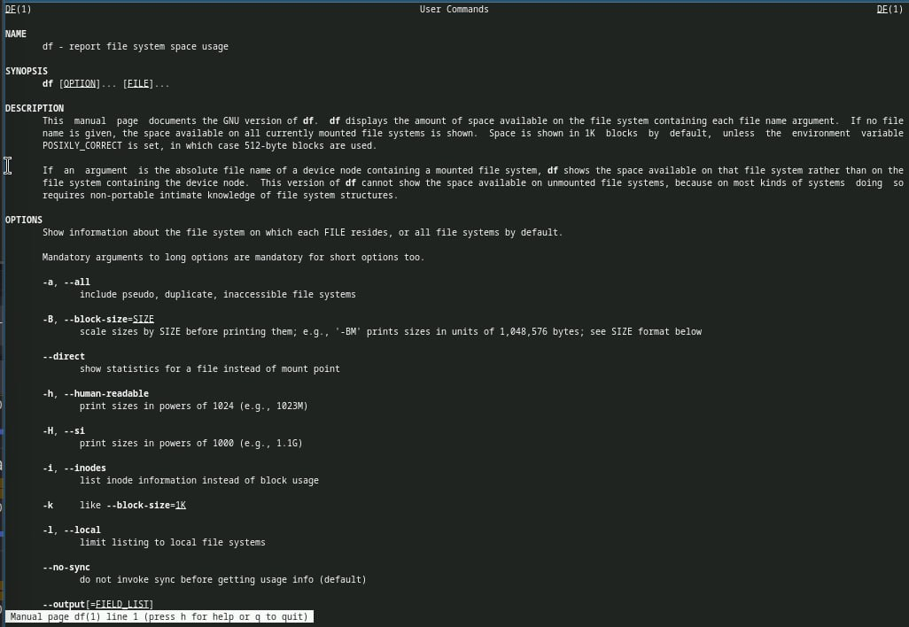

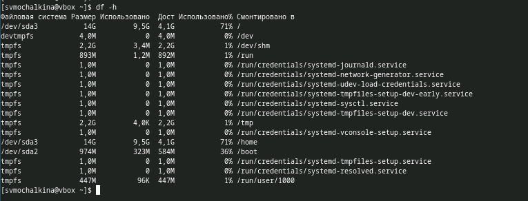

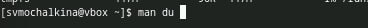

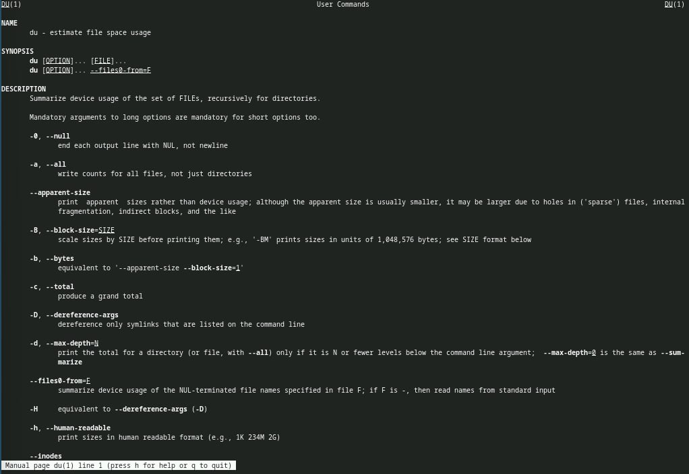

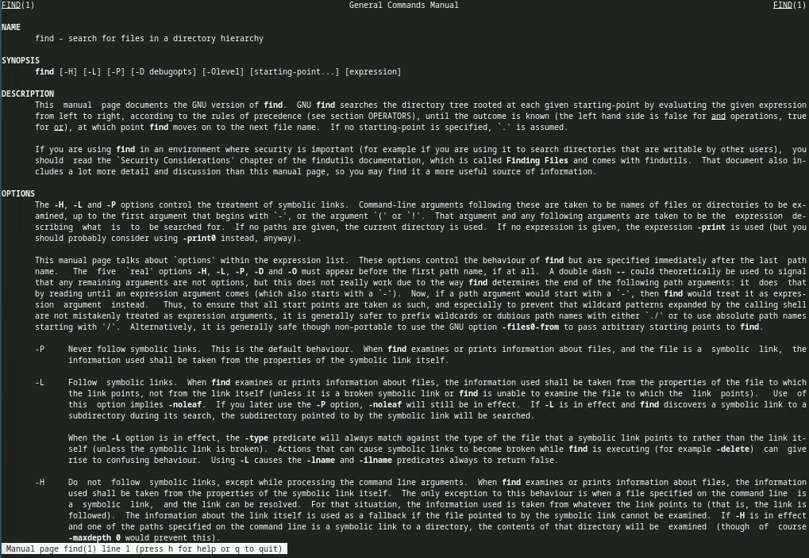

## Воспользовавшись справкой команды find, вывожу имена всех директорий, имеющихся в домашнем каталоге.

## Выводы

Я ознакомилась с инструментами поиска файлов и фильтрации текстовых данных.
Приобрела практических навыков: по управлению процессами (и заданиями), по
проверке использования диска и обслуживанию файловых систем.

