---
## Front matter
title: "Лабораторная работа 8"
subtitle: "Поиск файлов. Перенаправление
ввода-вывода. Просмотр запущенных процессов"
author: "Мочалкина Софья Васильевна"

## Generic otions
lang: ru-RU
toc-title: "Содержание"

## Bibliography
bibliography: bib/cite.bib
csl: pandoc/csl/gost-r-7-0-5-2008-numeric.csl

## Pdf output format
toc: true # Table of contents
toc-depth: 2
lof: true # List of figures
lot: true # List of tables
fontsize: 12pt
linestretch: 1.5
papersize: a4
documentclass: scrreprt
## I18n polyglossia
polyglossia-lang:
  name: russian
  options:
	- spelling=modern
	- babelshorthands=true
polyglossia-otherlangs:
  name: english
## I18n babel
babel-lang: russian
babel-otherlangs: english
## Fonts
mainfont: IBM Plex Serif
romanfont: IBM Plex Serif
sansfont: IBM Plex Sans
monofont: IBM Plex Mono
mathfont: STIX Two Math
mainfontoptions: Ligatures=Common,Ligatures=TeX,Scale=0.94
romanfontoptions: Ligatures=Common,Ligatures=TeX,Scale=0.94
sansfontoptions: Ligatures=Common,Ligatures=TeX,Scale=MatchLowercase,Scale=0.94
monofontoptions: Scale=MatchLowercase,Scale=0.94,FakeStretch=0.9
mathfontoptions:
## Biblatex
biblatex: true
biblio-style: "gost-numeric"
biblatexoptions:
  - parentracker=true
  - backend=biber
  - hyperref=auto
  - language=auto
  - autolang=other*
  - citestyle=gost-numeric
## Pandoc-crossref LaTeX customization
figureTitle: "Рис."
tableTitle: "Таблица"
listingTitle: "Листинг"
lofTitle: "Список иллюстраций"
lotTitle: "Список таблиц"
lolTitle: "Листинги"
## Misc options
indent: true
header-includes:
  - \usepackage{indentfirst}
  - \usepackage{float} # keep figures where there are in the text
  - \floatplacement{figure}{H} # keep figures where there are in the text
---

# Цель работы

Ознакомление с инструментами поиска файлов и фильтрации текстовых данных.
Приобретение практических навыков: по управлению процессами (и заданиями), по
проверке использования диска и обслуживанию файловых систем.

# Задание

1) Осуществите вход в систему, используя соответствующее имя пользователя.
2) Запишите в файл file.txt названия файлов, содержащихся в каталоге /etc. Допи-
шите в этот же файл названия файлов, содержащихся в вашем домашнем каталоге.
3) Выведите имена всех файлов из file.txt, имеющих расширение .conf, после чего
запишите их в новый текстовой файл conf.txt.
4) Определите, какие файлы в вашем домашнем каталоге имеют имена, начинавшиеся
с символа c? Предложите несколько вариантов, как это сделать.
5) Выведите на экран (по странично) имена файлов из каталога /etc, начинающиеся
с символа h.
6) Запустите в фоновом режиме процесс, который будет записывать в файл ~/logfile
файлы, имена которых начинаются с log.
7) Удалите файл ~/logfile.
8) Запустите из консоли в фоновом режиме редактор gedit.
9) Определите идентификатор процесса gedit, используя команду ps, конвейер и фильтр
grep. Как ещё можно определить идентификатор процесса?
10) Прочтите справку (man) команды kill, после чего используйте её для завершения
процесса gedit.
11) Выполните команды df и du, предварительно получив более подробную информацию
об этих командах, с помощью команды man.
12) Воспользовавшись справкой команды find, выведите имена всех директорий, имею-
щихся в вашем домашнем каталоге.

# Теоретическое введение

1 # Перенаправление stdout (вывода) в файл.
2 # Если файл отсутствовал, то он создаётся,
3 # иначе -- перезаписывается.
4
5 # Создаёт файл, содержащий список дерева каталогов.
6 ls -lR > dir-tree.list
7
8 1>filename
9 # Перенаправление вывода (stdout) в файл "filename".
10 1>>filename
11 # Перенаправление вывода (stdout) в файл "filename",
12 # файл открывается в режиме добавления.
13 2>filename
14 # Перенаправление stderr в файл "filename".
15 2>>filename
16 # Перенаправление stderr в файл "filename",
17 # файл открывается в режиме добавления.
18 &>filename
19 # Перенаправление stdout и stderr в файл "filename"

# Выполнение лабораторной работы
1) Осуществляю вход в систему, используя соответствующее имя пользователя.
2) Записываю в файл file.txt названия файлов, содержащихся в каталоге /etc. Дописываю в этот же файл названия файлов, содержащихся в домашнем каталоге.

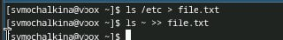{#fig:001 width=100%}

3) Вывожу имена всех файлов из file.txt, имеющих расширение .conf, после чего записываю их в новый текстовой файл conf.txt.

{#fig:001 width=100%}

4) Определяю, какие файлы в домашнем каталоге имеют имена, начинавшиеся с символа c. 

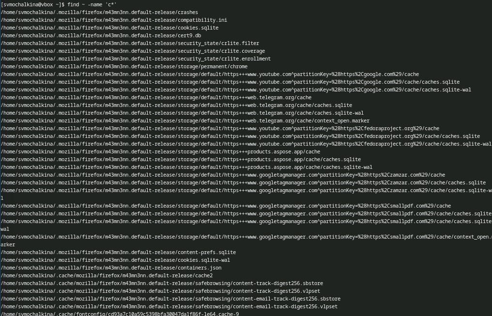{#fig:001 width=100%}

5) Вывожу на экран (по странично) имена файлов из каталога /etc, начинающиеся с символа h.

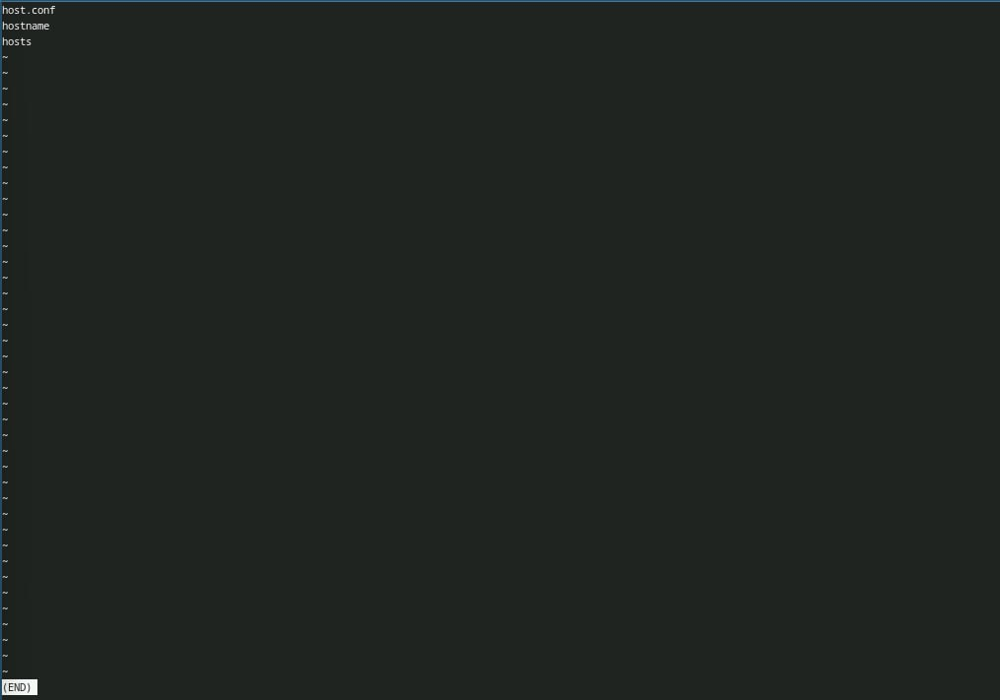{#fig:001 width=100%}

{#fig:001 width=100%}

6) Запускаю в фоновом режиме процесс, который будет записывать в файл ~/logfile файлы, имена которых начинаются с log.

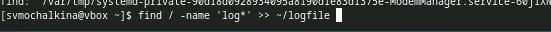{#fig:001 width=100%}

7) Удаляю файл ~/logfile.

{#fig:001 width=100%}

8) Запускаю из консоли в фоновом режиме редактор gedit.

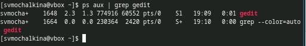{#fig:001 width=100%}

9) Определяю идентификатор процесса gedit, используя команду ps, конвейер и фильтр
grep. Можно также использовать pgrep gedit.

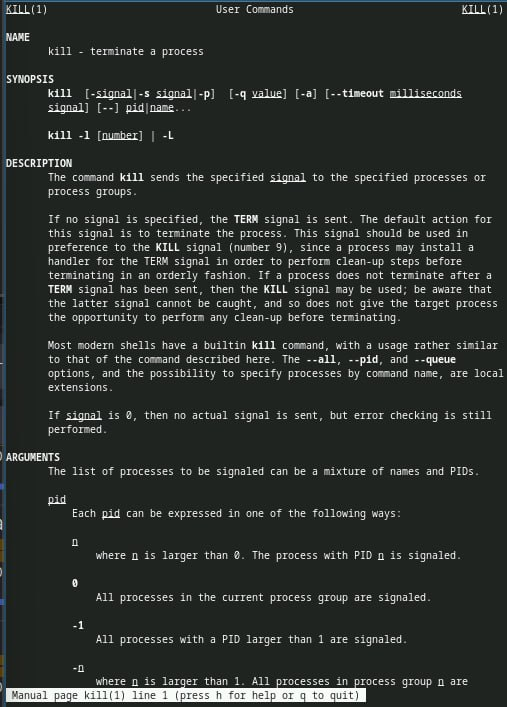{#fig:001 width=100%}

10) Читаю справку (man) команды kill, после чего использую её для завершения
процесса gedit.

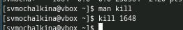{#fig:001 width=100%}

{#fig:001 width=100%}

11) Выполняю команды df и du, предварительно получив более подробную информацию
об этих командах, с помощью команды man.

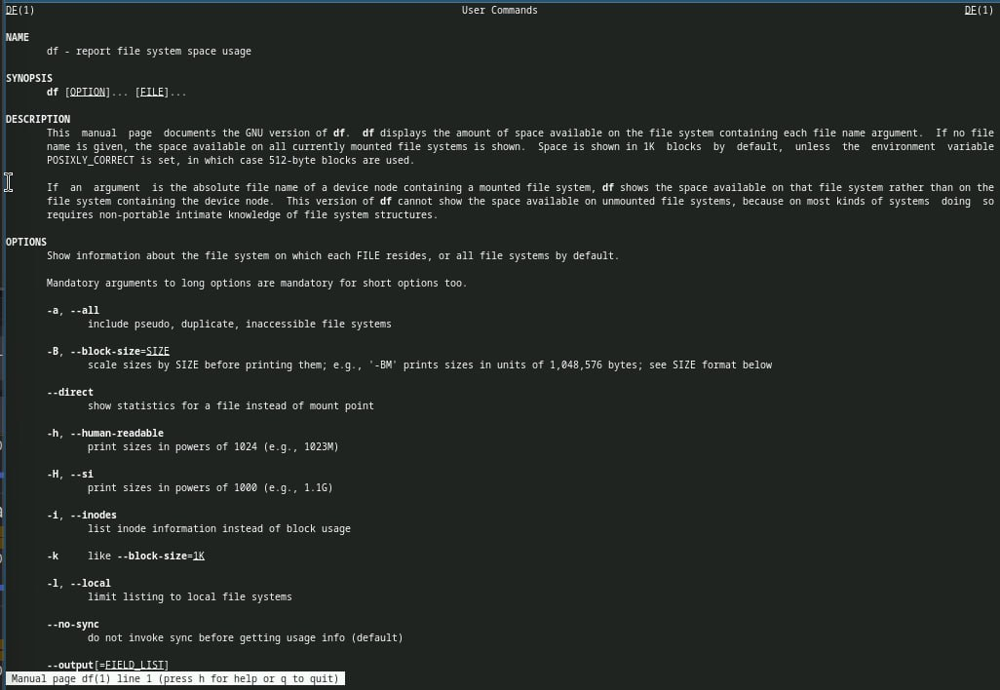{#fig:001 width=100%}

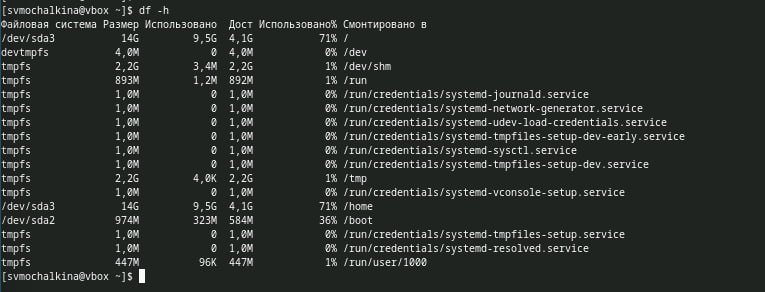{#fig:001 width=100%}

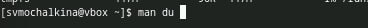{#fig:001 width=100%}

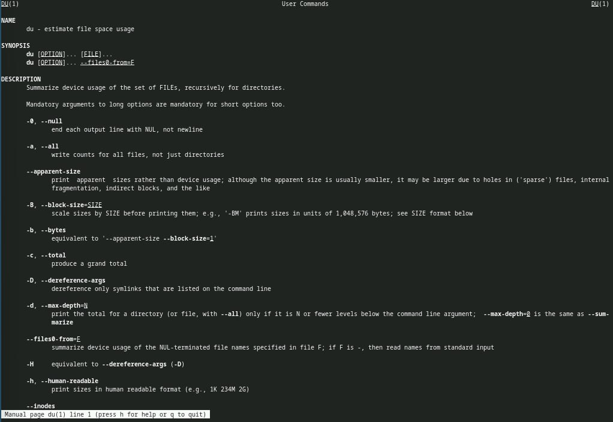{#fig:001 width=100%}

{#fig:001 width=100%}

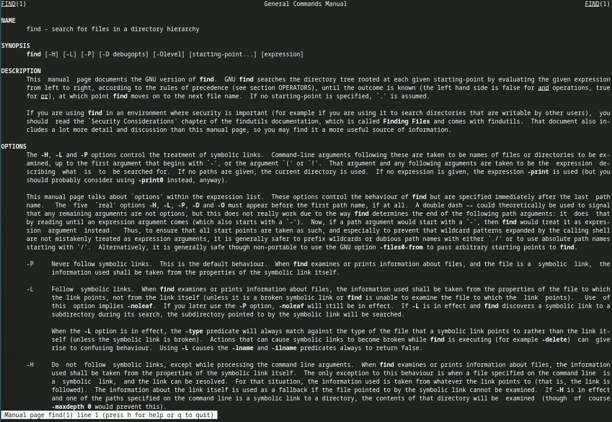{#fig:001 width=100%}

12) Воспользовавшись справкой команды find, вывожу имена всех директорий, имеющихся в домашнем каталоге.

{#fig:001 width=100%}

Ответы на контрольные вопросы:

1) Потоки ввода-вывода:
   - Стандартный ввод (stdin): Обычно это клавиатура. Используется для ввода данных в программу.
   - Стандартный вывод (stdout): Обычно это экран. Используется для вывода данных из программы.
   - Стандартный поток ошибок (stderr): Также выводит сообщения об ошибках, но отдельно от стандартного вывода.

2) Разница между операцией > и >>:
   - >: Перенаправляет стандартный вывод команды в файл, заменяя его содержимое. Если файл не существует, он будет создан.
   - >>: Перенаправляет стандартный вывод команды в файл, добавляя данные в конец файла. Если файл не существует, он будет создан.

3) Конвейер:
   Конвейер (pipe) — это механизм, который позволяет передавать вывод одной команды в качестве ввода для другой команды. В Unix-подобных системах это реализуется с помощью символа |. Например: ls -l | grep "txt".

4) Процесс:
   Процесс — это выполняемая программа, которая имеет свое собственное пространство памяти и системные ресурсы. Программа — это статический набор инструкций, тогда как процесс — это динамическое состояние выполнения этих инструкций. Процесс может состоять из одной или нескольких программ.

5) PID и GID:
   - PID (Process ID): Уникальный идентификатор процесса, который используется операционной системой для управления процессами.
   - GID (Group ID): Идентификатор группы, к которой принадлежит процесс. Он используется для управления правами доступа к ресурсам.

6) Задачи:
   Задачи — это процессы, которые выполняются в системе. Команда ps позволяет просматривать текущие задачи, а команда kill позволяет управлять ими (например, завершать).

7) Утилиты top и htop:
   - top: Команда, которая показывает текущие активные процессы и их использование ресурсов в реальном времени. Она предоставляет информацию о загрузке процессора, использовании памяти и т.д.
   - htop: Улучшенная версия top, которая имеет более удобный интерфейс, позволяет прокручивать список процессов и управлять ими более интуитивно.

8) Команда поиска файлов:
   - find: Команда для поиска файлов и каталогов в файловой системе по различным критериям (имя, размер, дата и т.д.).
     - Пример: find /path/to/search -name "*.txt" — ищет все текстовые файлы в указанном каталоге.

9) Поиск файла по контексту:
   Да, можно найти файл по содержимому с помощью команды grep. Например:
   - grep -r "нужный текст" /path/to/search — ищет текст в файлах в указанном каталоге и подкаталогах.

10) Определение объема свободной памяти на жёстком диске:
    Команда df -h показывает информацию о файловых системах, включая объем свободного места на диске.

11) Определение объема домашнего каталога:
    Команда du -sh ~ показывает общий объем всех файлов и подкаталогов в вашем домашнем каталоге.

12) Удаление зависшего процесса:
    Для удаления зависшего процесса можно использовать команду kill с PID процесса. Если процесс не реагирует, можно использовать kill -9 PID для принудительного завершения.

# Выводы

Я ознакомилась с инструментами поиска файлов и фильтрации текстовых данных.
Приобрела практических навыков: по управлению процессами (и заданиями), по
проверке использования диска и обслуживанию файловых систем.

