---
## Front matter
lang: ru-RU
title: "Лабораторная работа 9"
subtitle: "Командная оболочка Midnight
Commander"
author: "Мочалкина С. В."
institute: "Российский университет дружбы народов, Москва, Россия"
date: "12.04.2025"

## i18n babel
babel-lang: russian
babel-otherlangs: english

## Formatting pdf
toc: false
toc-title: Содержание
slide_level: 2
aspectratio: 169
section-titles: true
theme: metropolis
header-includes:
 - \metroset{progressbar=frametitle,sectionpage=progressbar,numbering=fraction}
---

# Информация

## Цель работы

Освоение основных возможностей командной оболочки Midnight Commander. Приоб-
ретение навыков практической работы по просмотру каталогов и файлов; манипуляций
с ними.

## Изучаю информацию о mc, вызвав в командной строке man mc.

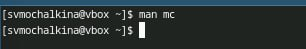

## Запускаю из командной строки mc, изучаю его структуру и меню.

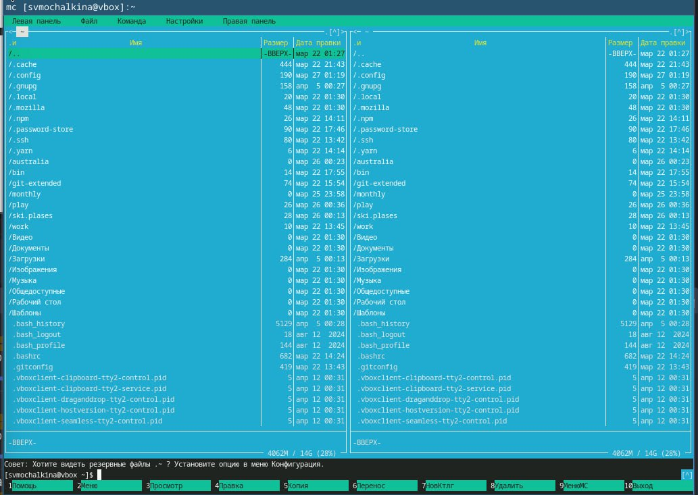

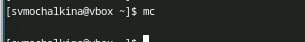

## просмотр содержимого текстового файла

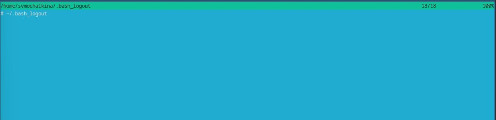

## редактирование содержимого текстового файла (без сохранения результатов)

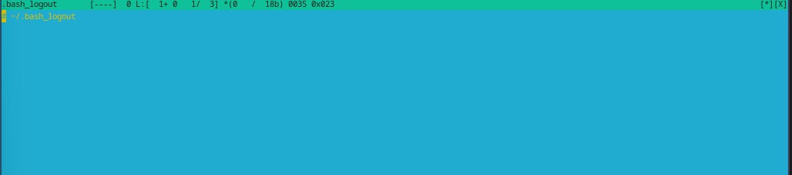

## создание каталога

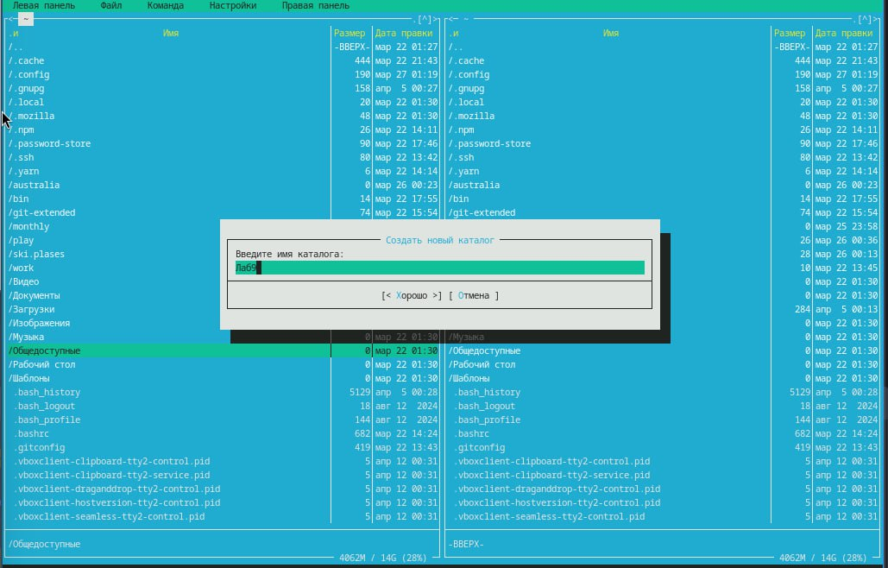

## копирование в файлов в созданный каталог.

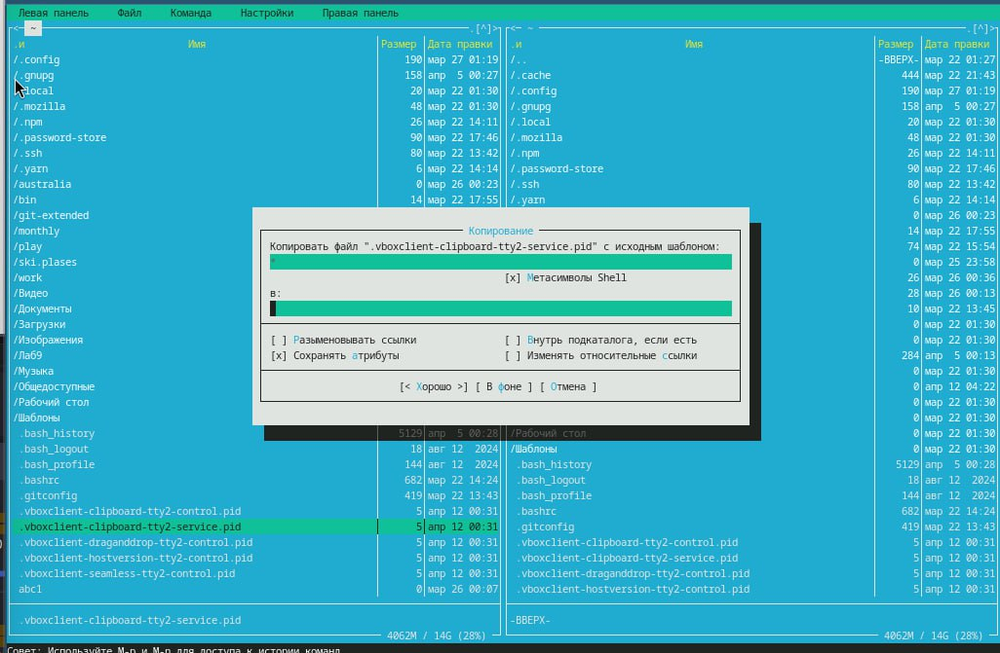

## – поиск в файловой системе файла с заданными условиями

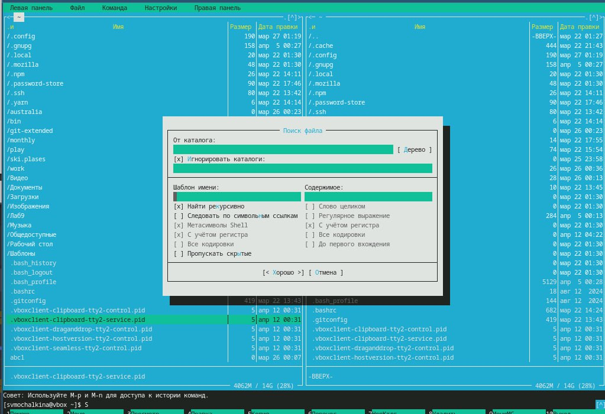

## Создаю текстовой файл text.txt.

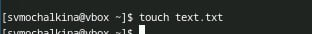

## Открываю этот файл с помощью встроенного в mc редактора

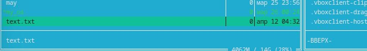

## Вставляю в открытый файл небольшой фрагмент текста, скопированный из Интернета

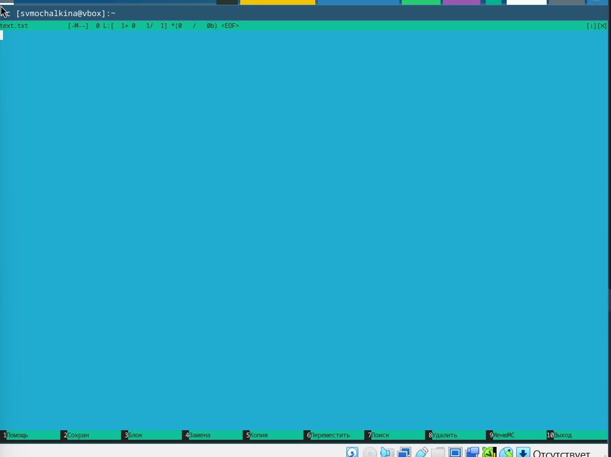

## Удаляю строку текста.

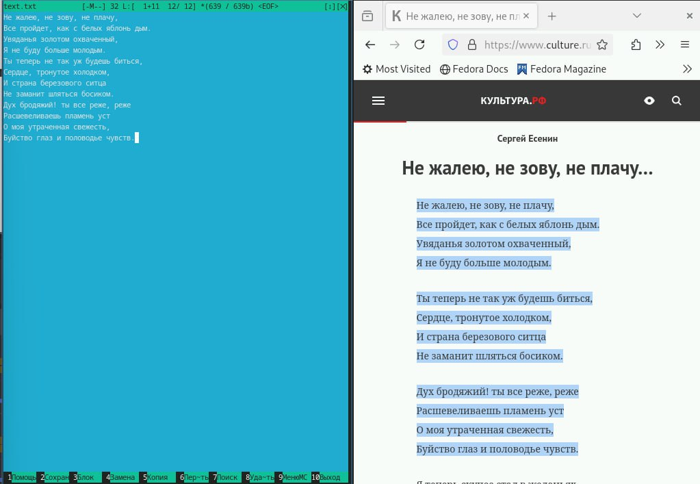

## Выделяю фрагмент текста и копирую его на новую строку

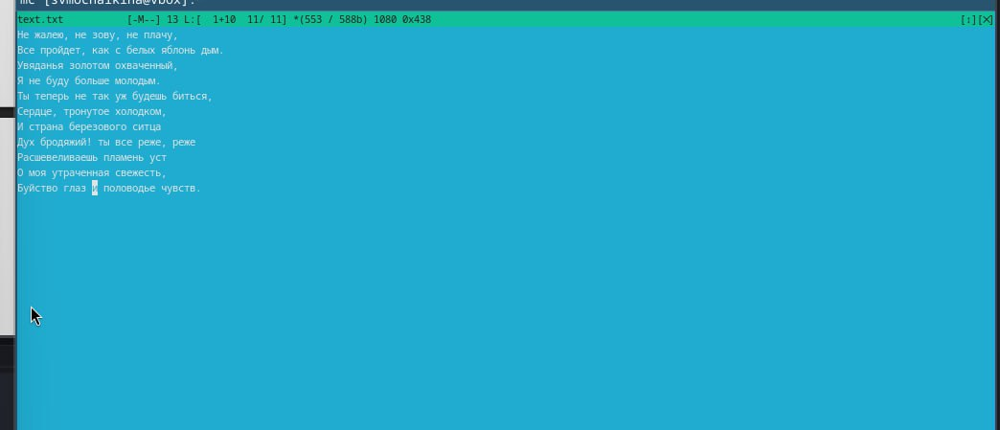

## Выделяю фрагмент текста и переношу его на новую строку

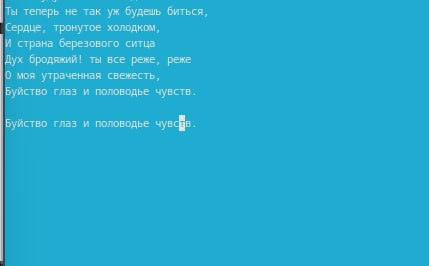

## Сохраняю файл

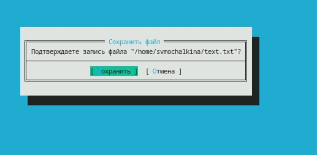

##  Отменяю последнее действие

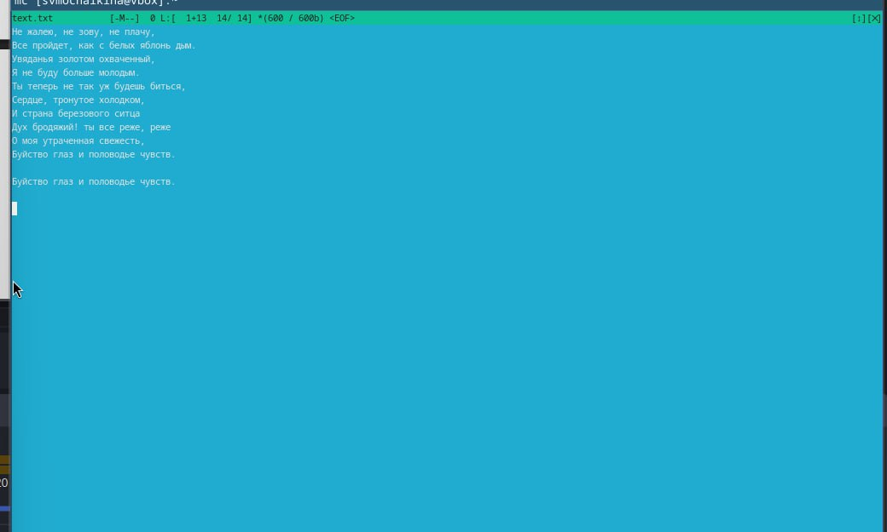

## Перехожу в конец файла (нажав комбинацию клавиш) и пишу некоторый текст.
 
 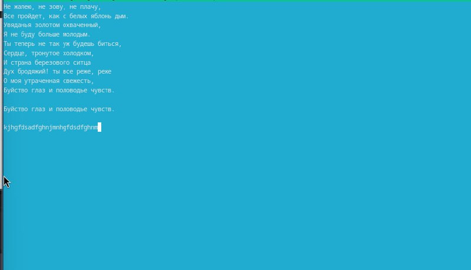
 
## 4.7. Перехожу в начало файла (нажав комбинацию клавиш) и пишу некоторый текст.

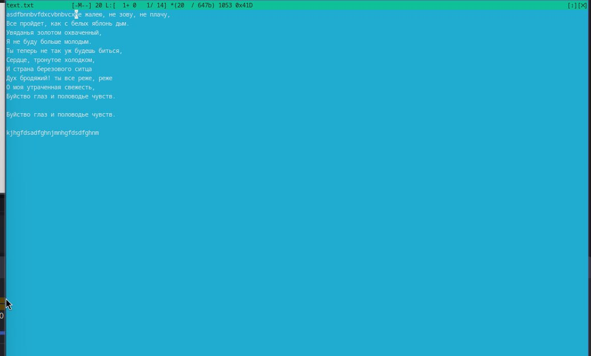

## Сохраняю и закрываю файл.

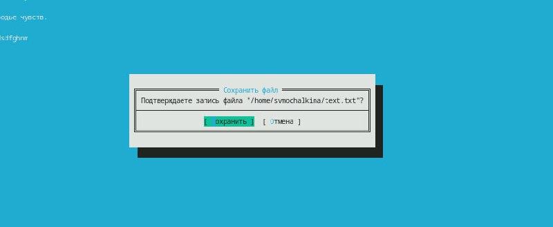

## Открываю файл с исходным текстом на некотором языке программирования (например C или Java)

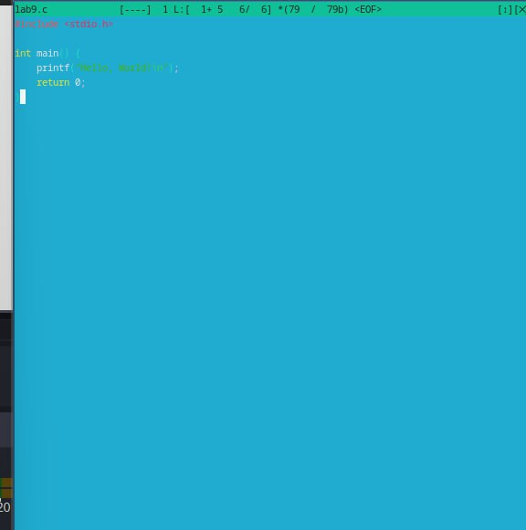

## Используя меню редактора выключаю подсветку текста.

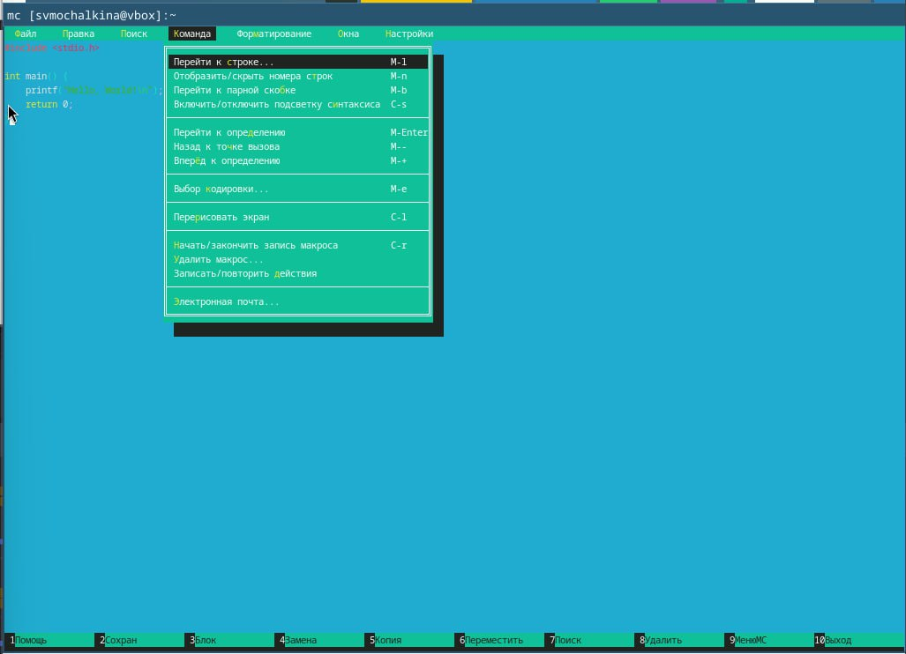

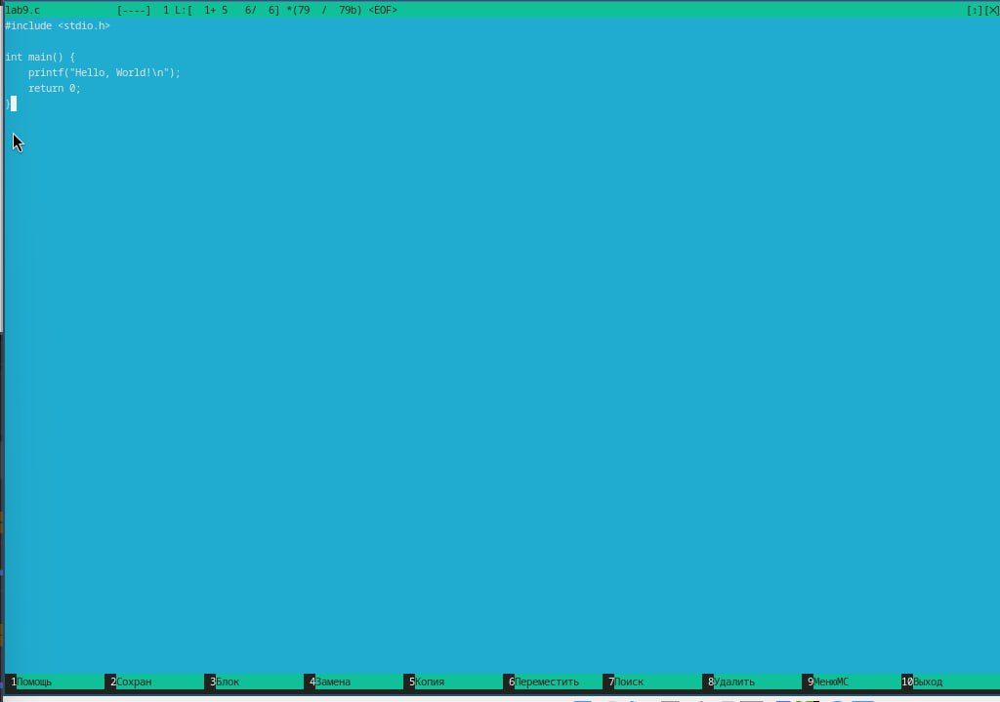

