---
## Front matter
title: "Лабораторная работа 9"
subtitle: "Командная оболочка Midnight
Commander"
author: "Мочалкина Софья Васильевна"

## Generic otions
lang: ru-RU
toc-title: "Содержание"

## Bibliography
bibliography: bib/cite.bib
csl: pandoc/csl/gost-r-7-0-5-2008-numeric.csl

## Pdf output format
toc: true # Table of contents
toc-depth: 2
lof: true # List of figures
lot: true # List of tables
fontsize: 12pt
linestretch: 1.5
papersize: a4
documentclass: scrreprt
## I18n polyglossia
polyglossia-lang:
  name: russian
  options:
	- spelling=modern
	- babelshorthands=true
polyglossia-otherlangs:
  name: english
## I18n babel
babel-lang: russian
babel-otherlangs: english
## Fonts
mainfont: IBM Plex Serif
romanfont: IBM Plex Serif
sansfont: IBM Plex Sans
monofont: IBM Plex Mono
mathfont: STIX Two Math
mainfontoptions: Ligatures=Common,Ligatures=TeX,Scale=0.94
romanfontoptions: Ligatures=Common,Ligatures=TeX,Scale=0.94
sansfontoptions: Ligatures=Common,Ligatures=TeX,Scale=MatchLowercase,Scale=0.94
monofontoptions: Scale=MatchLowercase,Scale=0.94,FakeStretch=0.9
mathfontoptions:
## Biblatex
biblatex: true
biblio-style: "gost-numeric"
biblatexoptions:
  - parentracker=true
  - backend=biber
  - hyperref=auto
  - language=auto
  - autolang=other*
  - citestyle=gost-numeric
## Pandoc-crossref LaTeX customization
figureTitle: "Рис."
tableTitle: "Таблица"
listingTitle: "Листинг"
lofTitle: "Список иллюстраций"
lotTitle: "Список таблиц"
lolTitle: "Листинги"
## Misc options
indent: true
header-includes:
  - \usepackage{indentfirst}
  - \usepackage{float} # keep figures where there are in the text
  - \floatplacement{figure}{H} # keep figures where there are in the text
---

# Цель работы

Освоение основных возможностей командной оболочки Midnight Commander. Приоб-
ретение навыков практической работы по просмотру каталогов и файлов; манипуляций
с ними.

# Задание

7.3.1. Задание по mc
1) Изучите информацию о mc, вызвав в командной строке man mc.
2) Запустите из командной строки mc, изучите его структуру и меню.
3) Выполните несколько операций в mc, используя управляющие клавиши (операции
с панелями; выделение/отмена выделения файлов, копирование/перемещение фай-
лов, получение информации о размере и правах доступа на файлы и/или каталоги
и т.п.)
4) Выполните основные команды меню левой (или правой) панели. Оцените степень
подробности вывода информации о файлах.
5) Используя возможности подменю Файл , выполните:
– просмотр содержимого текстового файла;
– редактирование содержимого текстового файла (без сохранения результатов
редактирования);
– создание каталога;
– копирование в файлов в созданный каталог.
6) С помощью соответствующих средств подменю Команда осуществите:
– поиск в файловой системе файла с заданными условиями (например, файла
с расширением .c или .cpp, содержащего строку main);
– выбор и повторение одной из предыдущих команд;
– переход в домашний каталог;
– анализ файла меню и файла расширений.
7) Вызовите подменю Настройки . Освойте операции, определяющие структуру экрана mc
(Full screen, Double Width, Show Hidden Files и т.д.)

7.3.2. Задание по встроенному редактору mc
1) Создайте текстовой файл text.txt.
2) Откройте этот файл с помощью встроенного в mc редактора.
3) Вставьте в открытый файл небольшой фрагмент текста, скопированный из любого
другого файла или Интернета.
4) Проделайте с текстом следующие манипуляции, используя горячие клавиши:
4.1. Удалите строку текста.
4.2. Выделите фрагмент текста и скопируйте его на новую строку.
4.3. Выделите фрагмент текста и перенесите его на новую строку.
4.4. Сохраните файл.
4.5. Отмените последнее действие.
4.6. Перейдите в конец файла (нажав комбинацию клавиш) и напишите некоторый
текст.
4.7. Перейдите в начало файла (нажав комбинацию клавиш) и напишите некоторый
текст.
4.8. Сохраните и закройте файл.
5) Откройте файл с исходным текстом на некотором языке программирования (напри-
мер C или Java)
6) Используя меню редактора, включите подсветку синтаксиса, если она не включена,
или выключите, если она включена.

# Выполнение лабораторной работы

7.3.1. Задание по mc
1) Изучаю информацию о mc, вызвав в командной строке man mc.

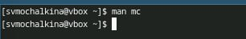{#fig:001 width=70%}

2) Запускаю из командной строки mc, изучаю его структуру и меню.

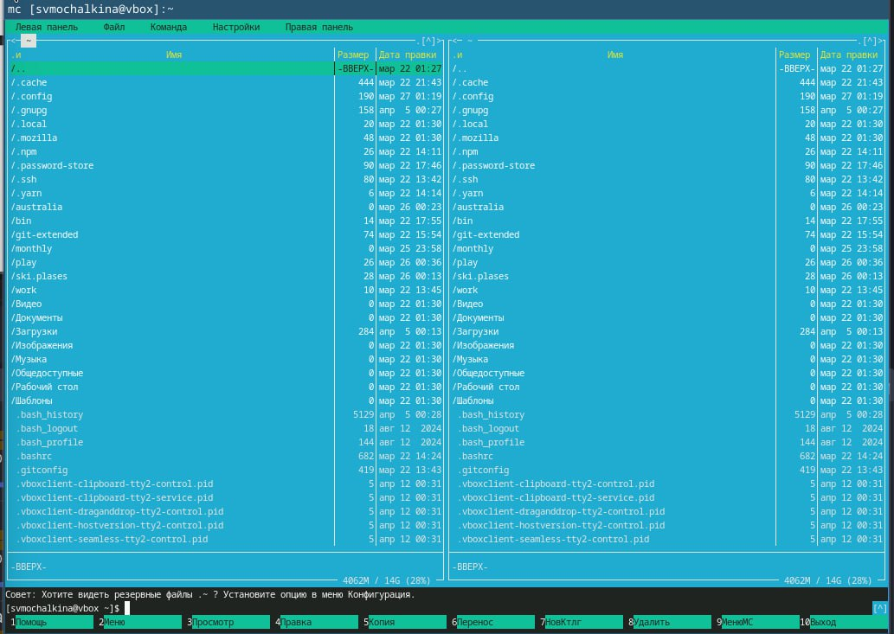{#fig:001 width=70%}

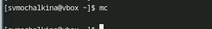{#fig:001 width=70%}

3) Выполняю несколько операций в mc, используя управляющие клавиши (операции
с панелями; выделение/отмена выделения файлов, копирование/перемещение фай-
лов, получение информации о размере и правах доступа на файлы и/или каталоги
и т.п.)
4) Выполняю основные команды меню левой (или правой) панели.
5) Используя возможности подменю Файл , выполняю:
– просмотр содержимого текстового файла;

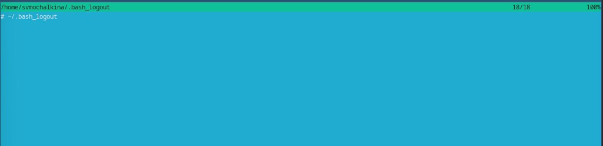{#fig:001 width=70%}

– редактирование содержимого текстового файла (без сохранения результатов)

{#fig:001 width=70%}

– создание каталога;

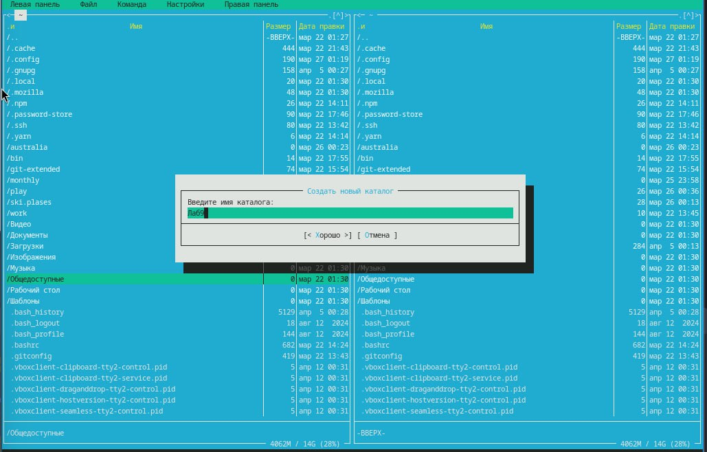{#fig:001 width=70%}

– копирование в файлов в созданный каталог.

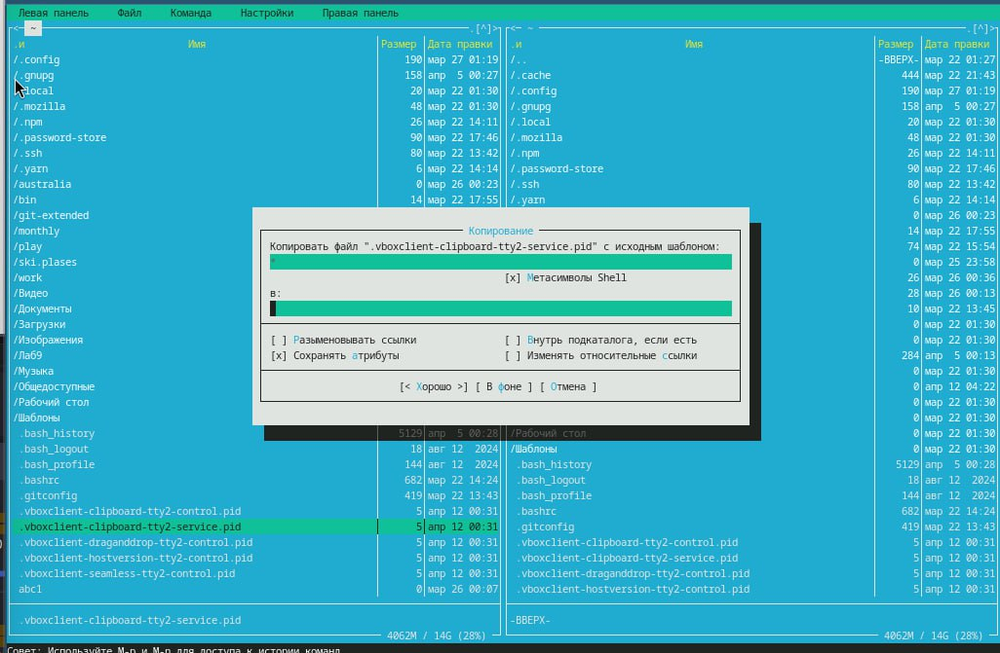{#fig:001 width=70%}

6) С помощью соответствующих средств подменю Команда осуществляю:
– поиск в файловой системе файла с заданными условиями (например, файла

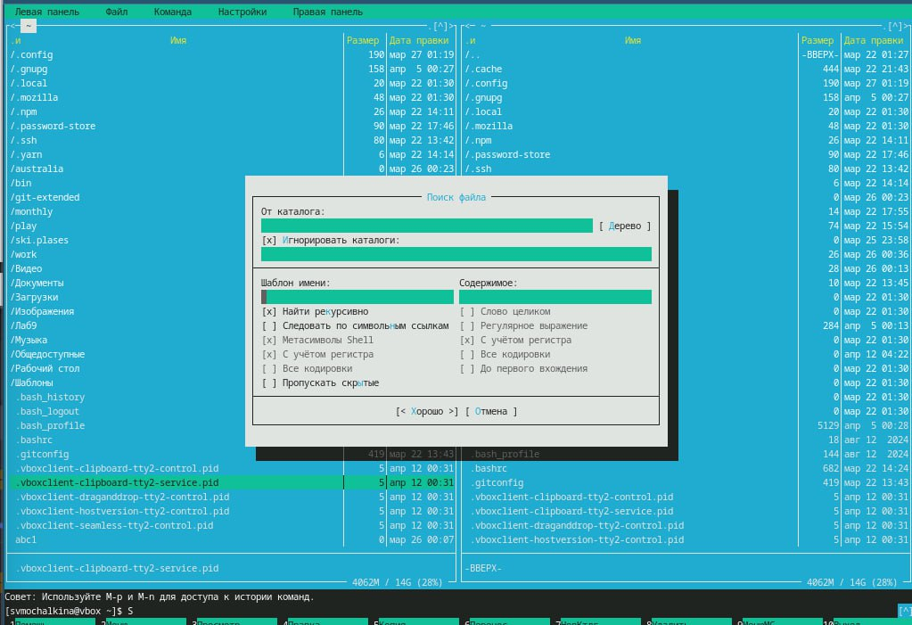{#fig:001 width=70%}

с расширением .c или .cpp, содержащего строку main);
– выбор и повторение одной из предыдущих команд;
– переход в домашний каталог;
– анализ файла меню и файла расширений.
7) Вызываю подменю Настройки. Осваиваю операции, определяющие структуру экрана mc
(Full screen, Double Width, Show Hidden Files и т.д.)

7.3.2. Задание по встроенному редактору mc
1) Создаю текстовой файл text.txt.

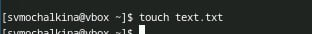{#fig:001 width=70%}

2) Открываю этот файл с помощью встроенного в mc редактора.

{#fig:001 width=70%}

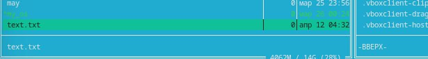{#fig:001 width=70%}

3) Вставляю в открытый файл небольшой фрагмент текста, скопированный из Интернета.

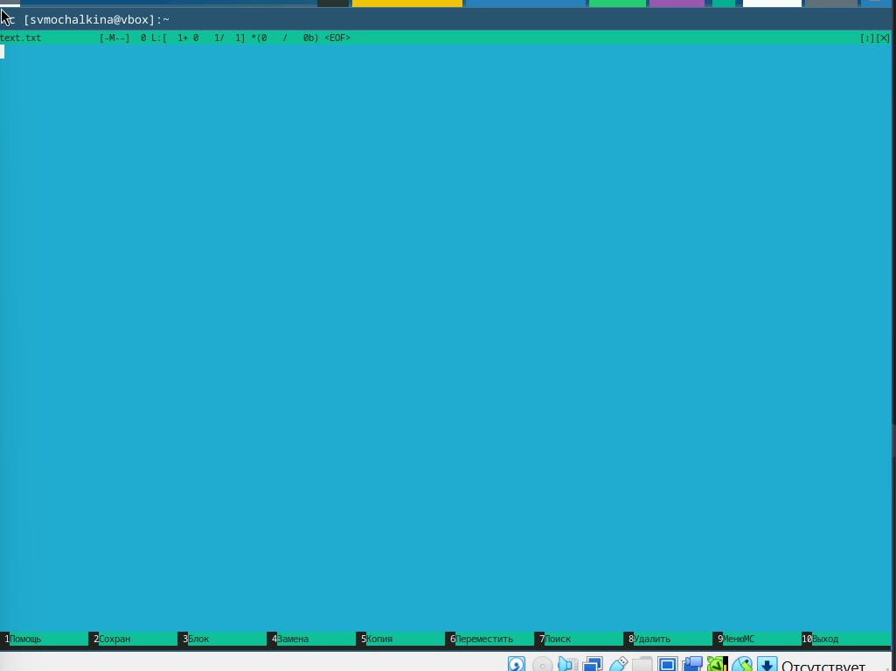{#fig:001 width=70%}

4) Проделываю с текстом следующие манипуляции, используя горячие клавиши:
4.1. Удаляю строку текста.

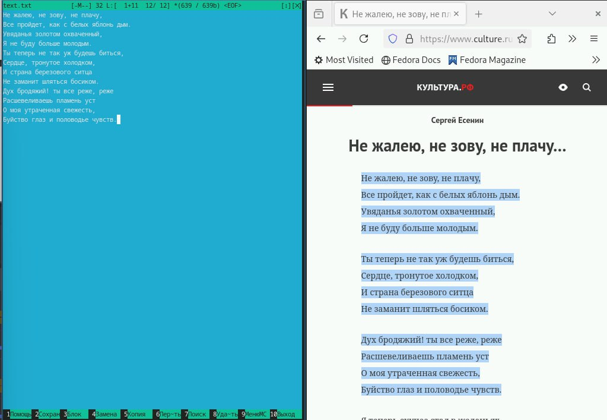{#fig:001 width=70%}

4.2. Выделяю фрагмент текста и копирую его на новую строку.

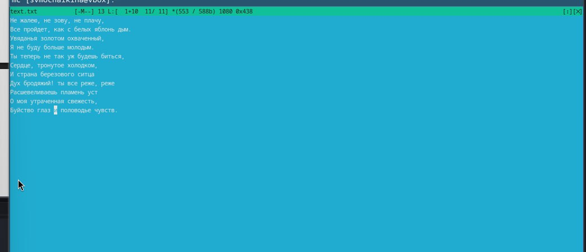{#fig:001 width=70%}

4.3. Выделяю фрагмент текста и переношу его на новую строку.

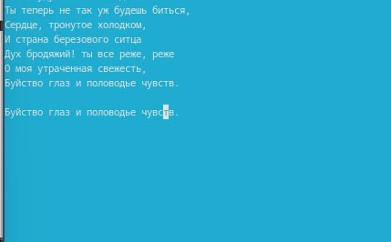{#fig:001 width=70%}

4.4. Сохраняю файл.

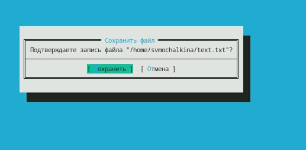{#fig:001 width=70%}

4.5. Отменяю последнее действие.

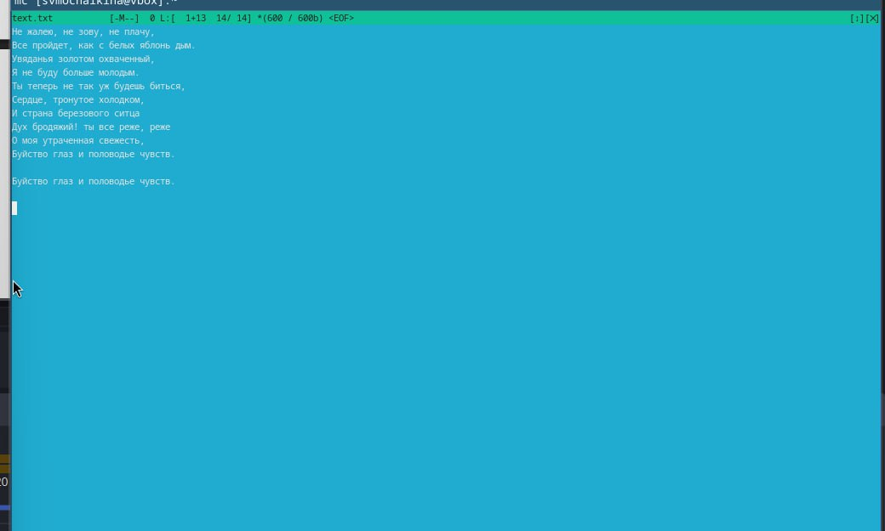{#fig:001 width=70%}

4.6. Перехожу в конец файла (нажав комбинацию клавиш) и пишу некоторый
текст.

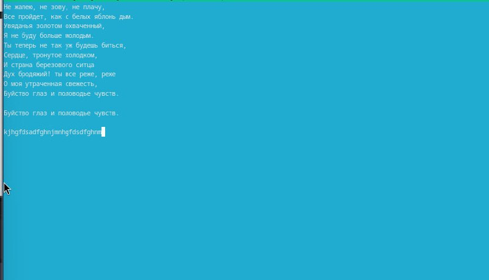{#fig:001 width=70%}

4.7. Перехожу в начало файла (нажав комбинацию клавиш) и пишу некоторый текст.

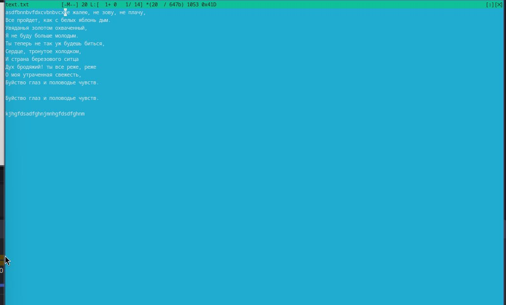{#fig:001 width=70%}

4.8. Сохраняю и закрываю файл.

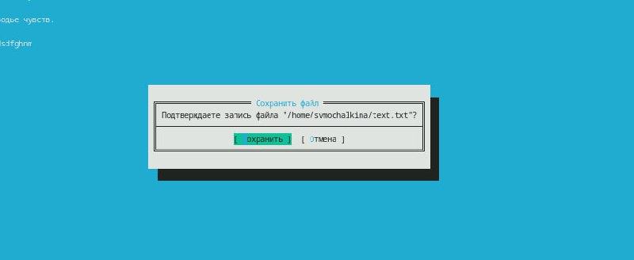{#fig:001 width=70%}

5) Открываю файл с исходным текстом на некотором языке программирования (например C или Java)

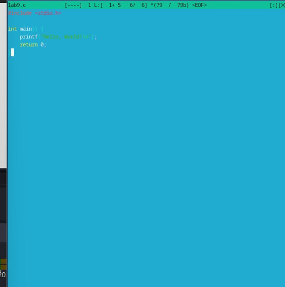{#fig:001 width=70%}

6) Используя меню редактора выключаю подсветку текста.

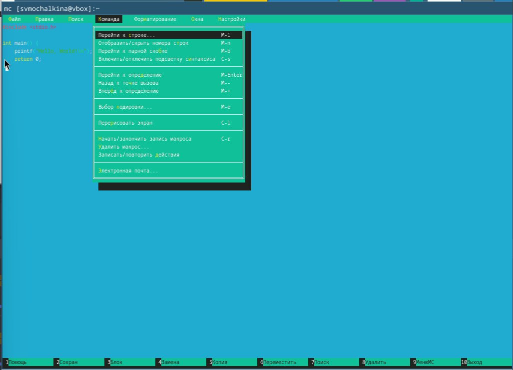{#fig:001 width=70%}

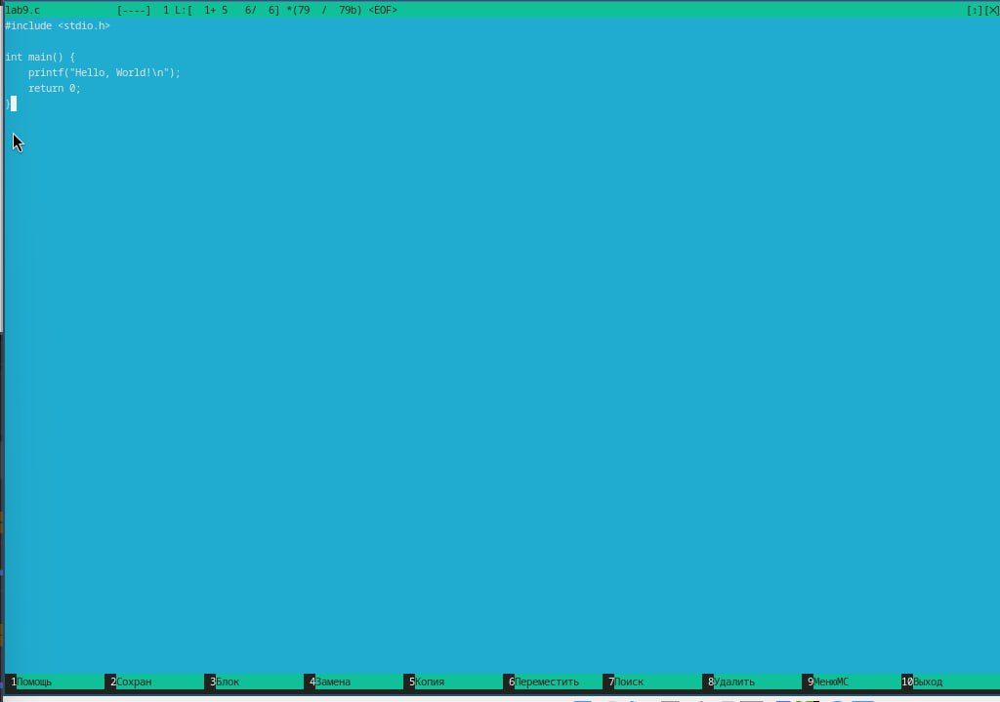{#fig:001 width=70%}

Контрольные вопросы.

1) Режимы работы в mc
Midnight Commander имеет два основных режима работы:

Режим файлового менеджера: Это основной режим, в котором отображаются две панели. Каждая панель представляет собой файловую систему, что позволяет пользователю легко перемещаться между каталогами, копировать, перемещать и удалять файлы. В этом режиме можно использовать клавиши для навигации, выбора файлов и выполнения операций.

Режим встроенного редактора: Этот режим активируется при открытии файла (например, нажатием F4). В этом режиме доступен текстовый редактор, который позволяет редактировать текстовые файлы. Здесь можно использовать команды для копирования, вставки, удаления текста и других манипуляций.

2) Операции с файлами
В mc можно выполнять множество операций с файлами как с помощью команд shell, так и с помощью меню:

Копирование файла:

Shell: cp source.txt destination.txt
mc: Выделить файл и нажать F5.
Перемещение файла:

Shell: mv source.txt destination.txt
mc: Выделить файл и нажать F6.
Удаление файла:

Shell: rm file.txt
mc: Выделить файл и нажать F8.
Создание каталога:

Shell: mkdir new_folder
mc: Нажать F7.
3) Структура меню левой (или правой) панели mc
Левая и правая панели mc содержат следующие элементы:

Список файлов: Отображает файлы и каталоги в текущем каталоге.
Строка состояния: Показывает текущий путь, информацию о выделенном файле, а также доступные действия.
Команды: Позволяют выполнять операции с выделенными файлами, такие как копирование, перемещение и удаление.
4) Структура меню Файл mc
Меню "Файл" содержит следующие команды:

Открыть: Открывает выделенный файл в редакторе.
Копировать: Копирует выделенный файл или каталог.
Переместить: Перемещает выделенный файл или каталог.
Удалить: Удаляет выделенный файл или каталог.
Создать каталог: Создает новый каталог.
Обновить: Обновляет отображение файлов в панели.
5) Структура меню Команда mc
Меню "Команда" включает команды для выполнения различных операций:

Запуск команды: Позволяет выполнить произвольную команду shell.
Показать историю: Отображает историю введенных команд.
Очистить экран: Очищает экран терминала.
6) Структура меню Настройки mc
Меню "Настройки" содержит опции для настройки интерфейса mc:

Настройки панели: Позволяет изменять вид и поведение панелей.
Настройки редактора: Настройка параметров встроенного редактора.
Настройки цветов: Изменение цветовой схемы интерфейса.
7) Встроенные команды mc
Некоторые встроенные команды mc:

F1: Помощь — открывает справочную информацию.
F2: Сохранить — сохраняет изменения в редакторе.
F3: Выделить текст — начинает выделение текста в редакторе.
F4: Открыть файл — открывает выделенный файл в редакторе.
F5: Копировать — копирует выделенный файл или каталог.
F6: Переместить — перемещает выделенный файл или каталог.
F7: Создать каталог — создает новый каталог.
F8: Удалить — удаляет выделенный файл или каталог.
8) Команды встроенного редактора mc
Команды встроенного редактора:

Ctrl + O: Открыть файл.
Ctrl + S: Сохранить файл.
Ctrl + X: Закрыть редактор.
Ctrl + Y: Удалить строку.
Ctrl + U: Отменить последнее действие.
Ctrl + V: Вставить текст.
9) Средства mc для создания пользовательских меню
Midnight Commander позволяет создавать пользовательские меню с помощью конфигурационных файлов. Пользователи могут редактировать файлы конфигурации ~/.config/mc/mc.ini

# Выводы

Я освоила основные возможности командной оболочки Midnight Commander. Приоб-
рела навыки практической работы по просмотру каталогов и файлов; манипуляций
с ними.

