---
## Front matter
title: "Лабораторная работа 10"
subtitle: "Текстовый редактор vi"
author: "Мочалкина Софья Васильевна"

## Generic otions
lang: ru-RU
toc-title: "Содержание"

## Bibliography
bibliography: bib/cite.bib
csl: pandoc/csl/gost-r-7-0-5-2008-numeric.csl

## Pdf output format
toc: true # Table of contents
toc-depth: 2
lof: true # List of figures
lot: true # List of tables
fontsize: 12pt
linestretch: 1.5
papersize: a4
documentclass: scrreprt
## I18n polyglossia
polyglossia-lang:
  name: russian
  options:
	- spelling=modern
	- babelshorthands=true
polyglossia-otherlangs:
  name: english
## I18n babel
babel-lang: russian
babel-otherlangs: english
## Fonts
mainfont: IBM Plex Serif
romanfont: IBM Plex Serif
sansfont: IBM Plex Sans
monofont: IBM Plex Mono
mathfont: STIX Two Math
mainfontoptions: Ligatures=Common,Ligatures=TeX,Scale=0.94
romanfontoptions: Ligatures=Common,Ligatures=TeX,Scale=0.94
sansfontoptions: Ligatures=Common,Ligatures=TeX,Scale=MatchLowercase,Scale=0.94
monofontoptions: Scale=MatchLowercase,Scale=0.94,FakeStretch=0.9
mathfontoptions:
## Biblatex
biblatex: true
biblio-style: "gost-numeric"
biblatexoptions:
  - parentracker=true
  - backend=biber
  - hyperref=auto
  - language=auto
  - autolang=other*
  - citestyle=gost-numeric
## Pandoc-crossref LaTeX customization
figureTitle: "Рис."
tableTitle: "Таблица"
listingTitle: "Листинг"
lofTitle: "Список иллюстраций"
lotTitle: "Список таблиц"
lolTitle: "Листинги"
## Misc options
indent: true
header-includes:
  - \usepackage{indentfirst}
  - \usepackage{float} # keep figures where there are in the text
  - \floatplacement{figure}{H} # keep figures where there are in the text
---

# Цель работы

Познакомиться с операционной системой Linux. Получить практические навыки работы с редактором vi, установленным по умолчанию практически во всех дистрибутивах.

# Задание

Задание 1. Создание нового файла с использованием vi

1)Создайте каталог с именем ~/work/os/lab06.
2) Перейдите во вновь созданный каталог.
3) Вызовите vi и создайте файл hello.sh
  vi hello.sh
4) Нажмите клавишу i и вводите следующий текст.
1 #!/bin/bash
2 HELL=Hello
3 function hello {
4 LOCAL HELLO=World
5 echo $HELLO
6 }
7 echo $HELLO
8 hello
5) Нажмите клавишу Esc для перехода в командный режим после завершения ввода
текста.
6) Нажмите : для перехода в режим последней строки и внизу вашего экрана появится
приглашение в виде двоеточия.
7) Нажмите w (записать) и q (выйти), а затем нажмите клавишу Enter для сохранения
вашего текста и завершения работы.
8) Сделайте файл исполняемым
1 chmod +x hello.sh

Задание 2. Редактирование существующего файла
1) Вызовите vi на редактирование файла
1 vi ~/work/os/lab06/hello.sh
2) Установите курсор в конец слова HELL второй строки.
3) Перейдите в режим вставки и замените на HELLO. Нажмите Esc для возврата в команд-
ный режим.
4) Установите курсор на четвертую строку и сотрите слово LOCAL.
5) Перейдите в режим вставки и наберите следующий текст: local, нажмите Esc для
возврата в командный режим.
6) Установите курсор на последней строке файла. Вставьте после неё строку, содержащую
следующий текст: echo $HELLO.
7) Нажмите Esc для перехода в командный режим.
8) Удалите последнюю строку.
9) Введите команду отмены изменений u для отмены последней команды.
10) Введите символ : для перехода в режим последней строки. Запишите произведённые
изменения и выйдите из vi.

# Теоретическое введение

8.2.1.2. Команды позиционирования
– 0 (ноль) — переход в начало строки;
– $ — переход в конец строки;
– G — переход в конец файла;
– 𝑛 G — переход на строку с номером 𝑛.

8.2.1.3. Команды перемещения по файлу
– Ctrl-d — перейти на пол-экрана вперёд;
– Ctrl-u — перейти на пол-экрана назад;
– Ctrl-f — перейти на страницу вперёд;
– Ctrl-b — перейти на страницу назад.

8.2.1.4. Команды перемещения по словам1
– W или w — перейти на слово вперёд;
– 𝑛 W или 𝑛 w — перейти на 𝑛 слов вперёд;
– b или B — перейти на слово назад;
– 𝑛 b или 𝑛 B — перейти на 𝑛 слов назад.

8.2.2. Команды редактирования

8.2.2.1. Вставка текста
– а — вставить текст после курсора;
– А — вставить текст в конец строки;
– i — вставить текст перед курсором;
– 𝑛 i — вставить текст 𝑛 раз;
– I — вставить текст в начало строки.

8.2.2.2. Вставка строки
– о — вставить строку под курсором;
– О — вставить строку над курсором.

8.2.2.3. Удаление текста
– x — удалить один символ в буфер;
– d w — удалить одно слово в буфер;
– d $ — удалить в буфер текст от курсора до конца строки;
– d 0 — удалить в буфер текст от начала строки до позиции курсора;
– d d — удалить в буфер одну строку;
– 𝑛 d d — удалить в буфер 𝑛 строк.

8.2.2.4. Отмена и повтор произведённых изменений
– u — отменить последнее изменение;
– . — повторить последнее изменение.

8.2.2.5. Копирование текста в буфер
– Y — скопировать строку в буфер;
– 𝑛 Y — скопировать 𝑛 строк в буфер;
– y w — скопировать слово в буфер.

8.2.2.6. Вставка текста из буфера
– p — вставить текст из буфера после курсора;
– P — вставить текст из буфера перед курсором.

8.2.2.7. Замена текста
– c w — заменить слово;
– 𝑛 c w — заменить 𝑛 слов;
– c $ — заменить текст от курсора до конца строки;
– r — заменить слово;
– R — заменить текст.

8.2.2.8. Поиск текста
– / текст — произвести поиск вперёд по тексту указанной строки символов текст;
– ? текст — произвести поиск назад по тексту указанной строки символов текст.

8.2.3. Команды редактирования в режиме командной строки

8.2.3.1. Копирование и перемещение текста
– : 𝑛,𝑚 d — удалить строки с 𝑛 по 𝑚;
– : 𝑖,𝑗 m 𝑘 — переместить строки с 𝑖 по 𝑗, начиная со строки 𝑘;
– : 𝑖,𝑗 t 𝑘 — копировать строки с 𝑖 по 𝑗 в строку 𝑘;
– : 𝑖,𝑗 w имя-файла — записать строки с 𝑖 по 𝑗 в файл с именем имя-файла.

8.2.3.2. Запись в файл и выход из редактора
– : w — записать изменённый текст в файл, не выходя из vi;
– : w имя-файла — записать изменённый текст в новый файл с именем имя-файла;
– : w ! имя-файла — записать изменённый текст в файл с именем имя-файла;
– : w q — записать изменения в файл и выйти из vi;
– : q — выйти из редактора vi;
– : q ! — выйти из редактора без записи;
 : e ! — вернуться в командный режим, отменив все изменения, произведённые
со времени последней записи.

8.2.4. Опции
Опции редактора vi позволяют настроить рабочую среду. Для задания опций использу-
ется команда set (в режиме последней строки):
– : set all — вывести полный список опций;
– : set nu — вывести номера строк;
– : set list — вывести невидимые символы;
– : set ic — не учитывать при поиске, является ли символ прописным или строчным.
Если вы хотите отказаться от использования опции, то в команде set перед именем
опции надо поставить no.
# Выполнение лабораторной работы

Задание 1. Создание нового файла с использованием vi

1)Создаю каталог с именем ~/work/os/lab06.

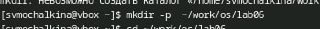{#fig:001 width=70%}

2) Перехожу во вновь созданный каталог.

{#fig:001 width=70%}

3) Вызываю vi и создаю файл hello.sh
  
{#fig:001 width=70%}
  
4) Нажима. клавишу i и ввожу следующий текст.
1 #!/bin/bash
2 HELL=Hello
3 function hello {
4 LOCAL HELLO=World
5 echo $HELLO
6 }
7 echo $HELLO
8 hello

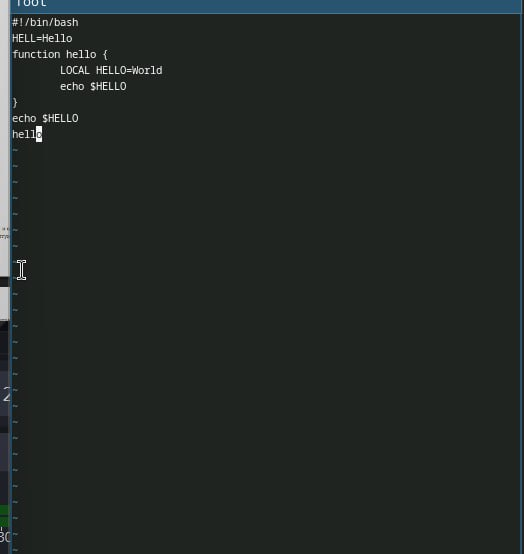{#fig:001 width=70%}

5) Нажмаю клавишу Esc для перехода в командный режим после завершения ввода
текста.

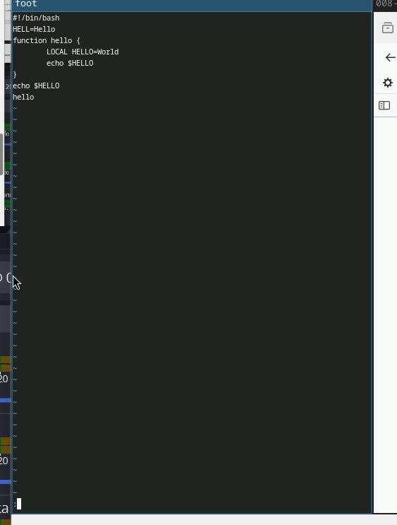{#fig:001 width=70%}

6) Нажимаю : для перехода в режим последней строки и внизу экрана появилось
приглашение в виде двоеточия. 7) Нажимаю w (записать) и q (выйти), а затем нажимаю клавишу Enter для сохранения
текста и завершения работы.

{#fig:001 width=70%}

8) Делаю файл исполняемым.

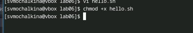{#fig:001 width=70%}

Задание 2. Редактирование существующего файла
1) Вызываю vi на редактирование файла

{#fig:001 width=70%}

2) Установливаю курсор в конец слова HELL второй строки.

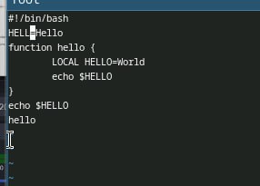{#fig:001 width=70%}

3) Перехожу в режим вставки и заменяю на HELLO. Нажимаю Esc для возврата в команд-
ный режим.

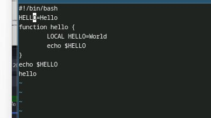{#fig:001 width=70%}

4) Установливаю курсор на четвертую строку и стираю слово LOCAL.

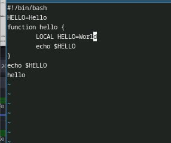{#fig:001 width=70%}

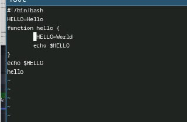{#fig:001 width=70%}

5) Перехожу в режим вставки и набераю следующий текст: local, нажимаю Esc для
возврата в командный режим.

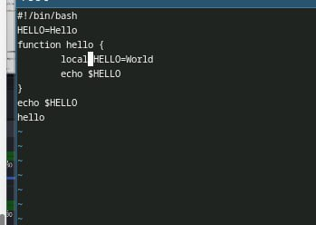{#fig:001 width=70%}

6) Установливаю курсор на последней строке файла. Вставляю после неё строку, содержащую
следующий текст: echo $HELLO.

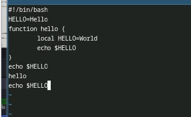{#fig:001 width=70%}

7) Нажимаю Esc для перехода в командный режим. 8) Удаляю последнюю строку.

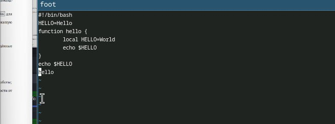{#fig:001 width=70%}

9) Ввожу команду отмены изменений u для отмены последней команды.

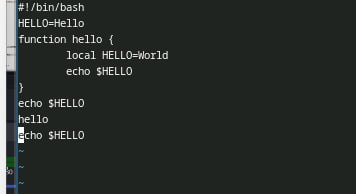{#fig:001 width=70%}

10) Ввожу символ : для перехода в режим последней строки. Записываю произведённые
изменения и выхожу из vi.

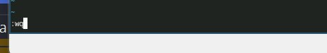{#fig:001 width=70%}

# Контрольные вопросы

1) Режимы работы редактора vi
Редактор vi работает в трех основных режимах:
- Нормальный режим: Режим по умолчанию, в котором можно перемещаться по тексту и выполнять команды редактирования.
- Режим вставки: Позволяет вводить текст. Вход в этот режим осуществляется с помощью команды i (вставка перед курсором) или a (вставка после курсора).
- Режим последней строки: Позволяет вводить команды для сохранения, выхода и других операций. Вход в этот режим осуществляется с помощью клавиши :.

2) Как выйти из редактора, не сохраняя изменения?
Чтобы выйти из редактора vi, не сохраняя изменения, введите :q! и нажмите Enter.

3) Команды позиционирования
Команды позиционирования позволяют перемещаться по тексту:
- h: перемещение влево на один символ.
- j: перемещение вниз на одну строку.
- k: перемещение вверх на одну строку.
- l: перемещение вправо на один символ.
- 0: переход к началу строки.
- $: переход к концу строки.
- G: переход к последней строке файла.
- gg: переход к первой строке файла.

4) Что для редактора vi является словом?
В редакторе vi словом считается последовательность символов, разделенная пробелами или знаками препинания. Например, слово может состоять из букв, цифр и некоторых специальных символов.

5) Как перейти в начало (конец) файла?
- Для перехода в начало файла используйте gg.
- Для перехода в конец файла используйте G.

6) Основные группы команд редактирования
- Вставка: команды для добавления текста (i, a, o, O).
- Удаление: команды для удаления текста (d, x, dw, dd).
- Копирование и вставка: команды для копирования (y) и вставки (p).
- Замена: команда для замены символов (r, R).

7) Заполнение строки символами $
Чтобы заполнить строку символами $, выполните следующие действия:
1) Перейдите в режим вставки, нажав i.
2) Введите символ $ столько раз, сколько необходимо.
3) Нажмите Esc для выхода из режима вставки.

8) Как отменить некорректное действие?
Чтобы отменить последнее действие, используйте команду u в нормальном режиме.

9) Основные группы команд режима последней строки
- Сохранение: :w (сохранить изменения).
- Выход: :q (выйти из редактора).
- Сохранение и выход: :wq или :x.
- Принудительный выход: :q! (выйти без сохранения).

10) Как определить позицию, в которой заканчивается строка?
В нормальном режиме можно использовать команду $, которая переместит курсор в конец текущей строки. Также можно посмотреть номер строки и позицию курсора в строке в правом нижнем углу экрана.

11) Опции редактора vi
Опции редактора vi можно узнать с помощью команды :set. Некоторые из них:
- number: отображать номера строк.
- ignorecase: игнорировать регистр при поиске.
- showmode: показывать текущий режим работы.

12) Как определить режим работы редактора vi?
Режим работы редактора можно определить по тому, как реагирует курсор на нажатие клавиш. В нормальном режиме курсор перемещается, в режиме вставки — вводится текст, а в режиме последней строки вы можете вводить команды.
13) Граф взаимосвязи режимов работы редактора vi
`
Нормальный режим
       |
       | (вход в режим вставки)
       v
  Режим вставки
       ^
       |
       | (вход в режим последней строки)
       |
  Режим последней строки

# Выводы

Я познакомилась с операционной системой Linux. Получила практические навыки работы с редактором vi, установленным по умолчанию практически во всех дистрибутивах.

