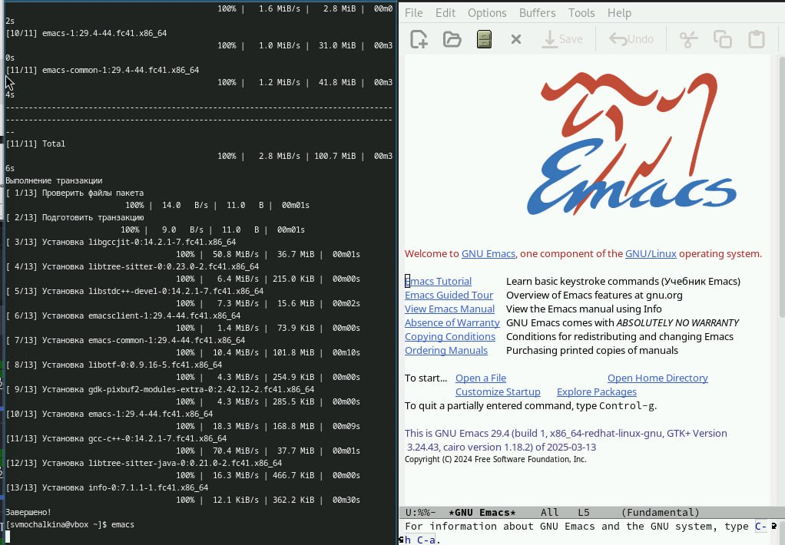
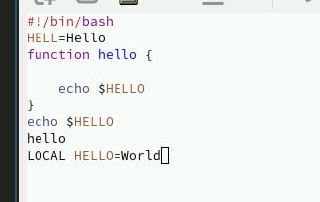
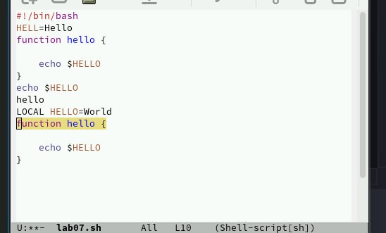

---
## Front matter
title: "Лабораторная работа 11"
subtitle: "Текстовой редактор emacs"
author: "Мочалкина Софья Васильевна"

## Generic otions
lang: ru-RU
toc-title: "Содержание"

## Bibliography
bibliography: bib/cite.bib
csl: pandoc/csl/gost-r-7-0-5-2008-numeric.csl

## Pdf output format
toc: true # Table of contents
toc-depth: 2
lof: true # List of figures
lot: true # List of tables
fontsize: 12pt
linestretch: 1.5
papersize: a4
documentclass: scrreprt
## I18n polyglossia
polyglossia-lang:
  name: russian
  options:
	- spelling=modern
	- babelshorthands=true
polyglossia-otherlangs:
  name: english
## I18n babel
babel-lang: russian
babel-otherlangs: english
## Fonts
mainfont: IBM Plex Serif
romanfont: IBM Plex Serif
sansfont: IBM Plex Sans
monofont: IBM Plex Mono
mathfont: STIX Two Math
mainfontoptions: Ligatures=Common,Ligatures=TeX,Scale=0.94
romanfontoptions: Ligatures=Common,Ligatures=TeX,Scale=0.94
sansfontoptions: Ligatures=Common,Ligatures=TeX,Scale=MatchLowercase,Scale=0.94
monofontoptions: Scale=MatchLowercase,Scale=0.94,FakeStretch=0.9
mathfontoptions:
## Biblatex
biblatex: true
biblio-style: "gost-numeric"
biblatexoptions:
  - parentracker=true
  - backend=biber
  - hyperref=auto
  - language=auto
  - autolang=other*
  - citestyle=gost-numeric
## Pandoc-crossref LaTeX customization
figureTitle: "Рис."
tableTitle: "Таблица"
listingTitle: "Листинг"
lofTitle: "Список иллюстраций"
lotTitle: "Список таблиц"
lolTitle: "Листинги"
## Misc options
indent: true
header-includes:
  - \usepackage{indentfirst}
  - \usepackage{float} # keep figures where there are in the text
  - \floatplacement{figure}{H} # keep figures where there are in the text
---

# Цель работы

Познакомиться с операционной системой Linux. Получить практические навыки работы с редактором Emacs.

# Задание

1) Открыть emacs.
2) Создать файл lab07.sh с помощью комбинации Ctrl-x Ctrl-f (C-x C-f).
3) Наберите текст:
1 #!/bin/bash
2 HELL=Hello
3 function hello {
4 LOCAL HELLO=World
5 echo $HELLO
6 }
echo $HELLO
8 hello
4) Сохранить файл с помощью комбинации Ctrl-x Ctrl-s (C-x C-s).
5) Проделать с текстом стандартные процедуры редактирования, каждое действие долж-
но осуществляться комбинацией клавиш.
5.1. Вырезать одной командой целую строку (С-k).
5.2. Вставить эту строку в конец файла (C-y).
5.3. Выделить область текста (C-space).
5.4. Скопировать область в буфер обмена (M-w).
5.5. Вставить область в конец файла.
5.6. Вновь выделить эту область и на этот раз вырезать её (C-w).
5.7. Отмените последнее действие (C-/).
6) Научитесь использовать команды по перемещению курсора.
6.1. Переместите курсор в начало строки (C-a).
6.2. Переместите курсор в конец строки (C-e).
6.3. Переместите курсор в начало буфера (M-<).
6.4. Переместите курсор в конец буфера (M->).
7) Управление буферами.
7.1. Вывести список активных буферов на экран (C-x C-b).
7.2. Переместитесь во вновь открытое окно (C-x) o со списком открытых буферов
и переключитесь на другой буфер.
7.3. Закройте это окно (C-x 0).
7.4. Теперь вновь переключайтесь между буферами, но уже без вывода их списка на
экран (C-x b).
8) Управление окнами.
8.1. Поделите фрейм на 4 части: разделите фрейм на два окна по вертикали (C-x 3),
а затем каждое из этих окон на две части по горизонтали (C-x 2) (см. рис. 9.1)
8.2. В каждом из четырёх созданных окон откройте новый буфер (файл) и введите
несколько строк текста.
9) Режим поиска
9.1. Переключитесь в режим поиска (C-s) и найдите несколько слов, присутствующих
в тексте.
9.2. Переключайтесь между результатами поиска, нажимая C-s.
9.3. Выйдите из режима поиска, нажав C-g.
9.4. Перейдите в режим поиска и замены (M-%), введите текст, который следует найти
и заменить, нажмите Enter , затем введите текст для замены. После того как будут
подсвечены результаты поиска, нажмите ! для подтверждения замены.
9.5. Испробуйте другой режим поиска, нажав M-s o. Объясните, чем он отличается от
обычного режима?

# Выполнение лабораторной работы

В соответствии с заданием:

1) {#fig:001 width=70%}

{#fig:001 width=70%}

2) {#fig:001 width=70%}

3) {#fig:001 width=70%}

4) {#fig:001 width=70%}

{#fig:001 width=70%}

5.1) {#fig:001 width=70%}

{#fig:001 width=70%}

5.2) {#fig:001 width=70%}

5.3) {#fig:001 width=70%}

5.5) {#fig:001 width=70%}

5.6) {#fig:001 width=70%}

5.7) {#fig:001 width=70%}

6.1) {#fig:001 width=70%}

6.2) {#fig:001 width=70%}

6.4) {#fig:001 width=70%}

Контрольные вопросы: 

1. Кратко охарактеризуйте редактор Emacs.

Emacs - это мощный, расширяемый и настраиваемый текстовый редактор. Он гораздо больше, чем просто редактор: это интегрированная среда разработки (IDE) с возможностями работы с файлами, компиляции, отладки, электронной почты, чтения новостей и многого другого. Он известен своей высокой степенью кастомизации и расширяемости с помощью языка Emacs Lisp.

2. Какие особенности данного редактора могут сделать его сложным для освоения новичком?

Нестандартные сочетания клавиш: Emacs использует большое количество сочетаний клавиш, часто включающих клавиши Ctrl (C-) и Meta (M-), что может показаться непривычным пользователям других редакторов.
Кривая обучения: Широкий функционал и возможности кастомизации могут быть ошеломляющими для новичка. Нужно время, чтобы разобраться в основных концепциях и командах.
Emacs Lisp: Для расширения функциональности редактора необходимо знание языка Emacs Lisp, что может быть дополнительным барьером для тех, кто не знаком с программированием.
Интерфейс: Интерфейс Emacs, особенно в консольной версии, может показаться устаревшим по сравнению с современными графическими редакторами.
3. Своими словами опишите, что такое буфер и окно в терминологии Emacs’а.

Буфер: Это область памяти, в которой хранится текст или другой контент, который вы редактируете. Думайте о буфере как об открытом файле в памяти, даже если он еще не сохранен на диск. Каждый открытый файл, результаты команд, help-тексты - все отображается в своем буфере.

Окно: Это часть экрана, в которой отображается буфер. Одно окно может отображать только один буфер, но один буфер может отображаться в нескольких окнах одновременно. Окна используются для организации рабочего пространства и одновременной работы с несколькими файлами или отображения различной информации.

4. Можно ли открыть больше 10 буферов в одном окне?

Нет. В одном окне можно отобразить только один буфер за раз. Но можно иметь много буферов, и переключаться между ними в одном окне.

5. Какие буферы создаются по умолчанию при запуске Emacs?

При запуске Emacs обычно создается как минимум два буфера:

*scratch*: Буфер для временных заметок, экспериментов с Emacs Lisp и других целей. Он не сохраняется на диск автоматически.
*Messages*: Буфер для отображения сообщений от Emacs, таких как результаты команд, предупреждения и ошибки.
6. Какие клавиши вы нажмёте, чтобы ввести следующую комбинацию C-c | и C-c C-|?

C-c |: C-c (удерживайте Ctrl и нажмите c), затем нажмите | (вертикальную черту, обычно Shift + ).
C-c C-|: C-c (удерживайте Ctrl и нажмите c), отпустите Ctrl, затем снова C- (удерживайте Ctrl и нажмите), затем нажмите | (вертикальную черту, обычно Shift + ).
7. Как поделить текущее окно на две части?

По горизонтали (два окна сверху и снизу): C-x 2
По вертикали (два окна слева и справа): C-x 3
8. В каком файле хранятся настройки редактора Emacs?

Настройки редактора Emacs обычно хранятся в файле .emacs или .emacs.el (предпочтительнее) в домашнем каталоге пользователя. На новых версиях может также использоваться ~/.config/emacs/init.el.

9. Какую функцию выполняет клавиша ESC и можно ли её переназначить?

Клавиша ESC (Escape) в Emacs обычно используется как префиксная клавиша для команд Meta (M-). Например, ESC x (или M-x) позволяет ввести имя команды.

Да, клавишу ESC можно переназначить, как и любую другую клавишу в Emacs. Это делается с помощью Emacs Lisp в файле настроек.

10. Какой редактор вам показался удобнее в работе vi или Emacs? Поясните почему.

Этот вопрос субъективен. Выбор между Vi и Emacs - это вопрос личных предпочтений. Я, как большая языковая модель, не имею личных предпочтений. Однако, я могу сказать, что Emacs часто выбирают за его расширяемость и кастомизацию: Практически все в Emacs можно настроить и изменить.
Встроенные возможности: Emacs предлагает множество встроенных функций, выходящих за рамки простого редактирования текста.
Более интуитивные сочетания клавиш (для некоторых): Хотя сочетания клавиш Emacs могут показаться сложными, некоторые пользователи находят их более логичными, чем модальную систему Vi.
В то время как Vi/Vim ценится за:

Минимализм и скорость: Vi - легкий и быстрый редактор, который быстро запускается и работает на любой системе.
Эффективность в модальном редактировании: После освоения модальной системы редактирования Vi позволяет очень быстро перемещаться по тексту и выполнять редактирование.
Широкое распространение: Vi предустановлен на большинстве Unix-подобных систем.
# Выводы

Познакомилась с операционной системой Linux. Получила практические навыки работы с редактором Emacs.

