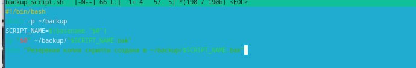
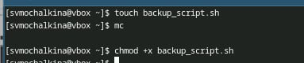
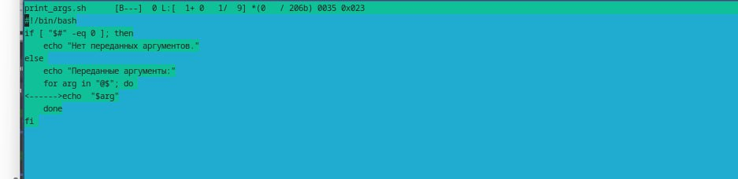
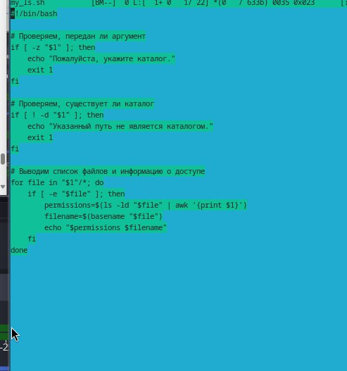
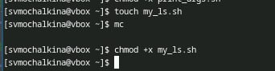
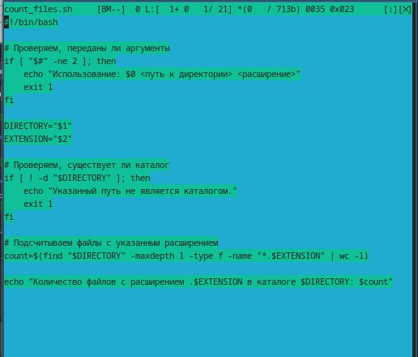
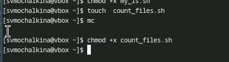

---
## Front matter
title: Лабораторная работа 12"
subtitle: "Программирование в командном
процессоре ОС UNIX. Командные файлы"
author: "Мочалкина Софья Васильевна"

## Generic otions
lang: ru-RU
toc-title: "Содержание"

## Bibliography
bibliography: bib/cite.bib
csl: pandoc/csl/gost-r-7-0-5-2008-numeric.csl

## Pdf output format
toc: true # Table of contents
toc-depth: 2
lof: true # List of figures
lot: true # List of tables
fontsize: 12pt
linestretch: 1.5
papersize: a4
documentclass: scrreprt
## I18n polyglossia
polyglossia-lang:
  name: russian
  options:
	- spelling=modern
	- babelshorthands=true
polyglossia-otherlangs:
  name: english
## I18n babel
babel-lang: russian
babel-otherlangs: english
## Fonts
mainfont: IBM Plex Serif
romanfont: IBM Plex Serif
sansfont: IBM Plex Sans
monofont: IBM Plex Mono
mathfont: STIX Two Math
mainfontoptions: Ligatures=Common,Ligatures=TeX,Scale=0.94
romanfontoptions: Ligatures=Common,Ligatures=TeX,Scale=0.94
sansfontoptions: Ligatures=Common,Ligatures=TeX,Scale=MatchLowercase,Scale=0.94
monofontoptions: Scale=MatchLowercase,Scale=0.94,FakeStretch=0.9
mathfontoptions:
## Biblatex
biblatex: true
biblio-style: "gost-numeric"
biblatexoptions:
  - parentracker=true
  - backend=biber
  - hyperref=auto
  - language=auto
  - autolang=other*
  - citestyle=gost-numeric
## Pandoc-crossref LaTeX customization
figureTitle: "Рис."
tableTitle: "Таблица"
listingTitle: "Листинг"
lofTitle: "Список иллюстраций"
lotTitle: "Список таблиц"
lolTitle: "Листинги"
## Misc options
indent: true
header-includes:
  - \usepackage{indentfirst}
  - \usepackage{float} # keep figures where there are in the text
  - \floatplacement{figure}{H} # keep figures where there are in the text
---

# Цель работы

Изучить основы программирования в оболочке ОС UNIX/Linux. Научиться писать небольшие командные файлы.

# Задание

1) Написать скрипт, который при запуске будет делать резервную копию самого себя (то
есть файла, в котором содержится его исходный код) в другую директорию backup
в вашем домашнем каталоге. При этом файл должен архивироваться одним из ар-
хиваторов на выбор zip, bzip2 или tar. Способ использования команд архивации
необходимо узнать, изучив справку.
2) Написать пример командного файла, обрабатывающего любое произвольное число
аргументов командной строки, в том числе превышающее десять. Например, скрипт
может последовательно распечатывать значения всех переданных аргументов.
3) Написать командный файл — аналог команды ls (без использования самой этой ко-
манды и команды dir). Требуется, чтобы он выдавал информацию о нужном каталоге
и выводил информацию о возможностях доступа к файлам этого каталога.
4) Написать командный файл, который получает в качестве аргумента командной строки
формат файла (.txt, .doc, .jpg, .pdf и т.д.) и вычисляет количество таких файлов
в указанной директории. Путь к директории также передаётся в виде аргумента ко-
мандной строки.

# Выполнение лабораторной работы

1) 
{#fig:001 width=70%}

{#fig:001 width=70%}

2)

{#fig:001 width=70%}

{#fig:001 width=70%}

3)

{#fig:001 width=70%}

{#fig:001 width=70%}

4)

{#fig:001 width=70%}

{#fig:001 width=70%}

Контрольные вопросы:

Ответы на вопросы о командной оболочке и Bash
1. Объясните понятие командной оболочки. Приведите примеры командных оболочек. Чем они отличаются?

Командная оболочка (shell) - это интерфейс между пользователем и ядром операционной системы. Она позволяет пользователю вводить команды, которые затем интерпретируются и выполняются операционной системой. Другими словами, это программа, которая принимает команды от пользователя (обычно текстовые), интерпретирует их и запускает соответствующие программы или функции операционной системы.

Примеры командных оболочек:

Bash (Bourne Again Shell): Самая распространенная командная оболочка в Linux и macOS.
Zsh (Z Shell): Расширенная версия Bash с множеством дополнительных функций и плагинов.
Fish (Friendly Interactive Shell): Командная оболочка, ориентированная на удобство использования, с автодополнением и подсветкой синтаксиса.
Ksh (Korn Shell): Более старая командная оболочка, но все еще используется в некоторых системах.
Csh (C Shell) / Tcsh (Tenex C Shell): Командные оболочки, синтаксис которых похож на язык программирования C.
PowerShell: Командная оболочка и язык сценариев от Microsoft, используемый в Windows.
Отличия командных оболочек:

Командные оболочки отличаются по нескольким параметрам:

Синтаксис: Командные оболочки могут использовать разный синтаксис для команд, переменных, условий и циклов.
Функциональность: Некоторые командные оболочки имеют более широкий набор встроенных команд и функций, чем другие.
Расширяемость: Некоторые командные оболочки более легко расширяются с помощью плагинов и скриптов.
Удобство использования: Некоторые командные оболочки ориентированы на удобство использования, предлагая автодополнение, подсветку синтаксиса и другие функции, облегчающие работу.
Совместимость: Некоторые командные оболочки более совместимы со стандартами POSIX, чем другие.
Лицензия: Командные оболочки распространяются под разными лицензиями (GPL, BSD, MIT и т.д.).
2. Что такое POSIX?

POSIX (Portable Operating System Interface) - это набор стандартов, разработанных IEEE (Institute of Electrical and Electronics Engineers) для обеспечения совместимости операционных систем. POSIX определяет стандарты для API (Application Programming Interface) и командной оболочки, что позволяет разрабатывать приложения, которые можно легко переносить между различными POSIX-совместимыми операционными системами (например, Unix, Linux, macOS).

POSIX не является конкретной операционной системой или командной оболочкой. Это набор стандартов, которым операционные системы и оболочки могут соответствовать.

3. Как определяются переменные и массивы в языке программирования bash?

Переменные:

Определение: имя_переменной=значение (Важно: нет пробелов вокруг знака =)
Пример: MY_VAR="Hello, world!"
Обращение: $имя_переменной или ${имя_переменной}
Пример: echo $MY_VAR
Массивы:

Определение: имя_массива=(элемент1 элемент2 элемент3 ...)
Пример: MY_ARRAY=(apple banana cherry)
Обращение к элементу: ${имя_массива[индекс]} (индекс начинается с 0)
Пример: echo ${MY_ARRAY[0]} (выведет “apple”)
Обращение ко всем элементам: ${имя_массива[@]} или ${имя_массива[*]}
Пример: echo ${MY_ARRAY[@]} (выведет “apple banana cherry”)
Длина массива: ${#имя_массива[@]} или ${#имя_массива[*]}
Пример: echo ${#MY_ARRAY[@]} (выведет “3”)
4. Каково назначение операторов let и read?

let: Используется для выполнения арифметических операций. Он оценивает арифметическое выражение и присваивает результат переменной. В современных версиях bash, оператор let не обязателен при использовании ((...)).

Пример: let "x = 5 + 3" или (( x = 5 + 3 )) (присвоит переменной x значение 8)
read: Используется для чтения ввода от пользователя (с клавиатуры) и присвоения этого ввода переменной.

Пример: read -p "Введите ваше имя: " name (выведет запрос “Введите ваше имя: ” и присвоит введенное значение переменной name)
5. Какие арифметические операции можно применять в языке программирования bash?

Bash поддерживает следующие арифметические операции:
+ (сложение)
- (вычитание)
* (умножение)
/ (деление)
% (остаток от деления)
** (возведение в степень)
Операции выполняются с целыми числами. Для работы с числами с плавающей точкой можно использовать утилиту bc.

6. Что означает операция (( ))?

Операция ((...)) используется для выполнения арифметических вычислений в bash. Внутри двойных круглых скобок можно использовать арифметические операторы, переменные и круглые скобки для группировки выражений. Оператор let становится необязательным.

Примеры:

(( x = 5 + 3 )) (присвоит переменной x значение 8)
(( i++ )) (увеличит значение переменной i на 1)
(( j = i * 2 )) (присвоит переменной j значение, равное удвоенному значению i)
if (( a > b )); then ... fi (использование в условии)
7. Какие стандартные имена переменных Вам известны?

Некоторые стандартные имена переменных в bash:

HOME: Путь к домашнему каталогу пользователя.
PWD: Текущий рабочий каталог.
OLDPWD: Предыдущий рабочий каталог (используется после cd).
PATH: Список каталогов, в которых bash ищет исполняемые файлы.
USER: Имя текущего пользователя.
UID: Числовой идентификатор текущего пользователя.
SHELL: Путь к текущей командной оболочке.
TERM: Тип терминала.
RANDOM: Генерирует случайное целое число (от 0 до 32767).
IFS: Разделитель полей (по умолчанию пробел, табуляция и перевод строки).
8. Что такое метасимволы?

Метасимволы (metacharacters) - это специальные символы, которые имеют особое значение для командной оболочки. Они используются для выполнения различных операций, таких как подстановка имен файлов, перенаправление ввода-вывода, группировка команд и т.д.

Примеры метасимволов:

* (подстановка всех файлов)
? (подстановка одного любого символа)
[] (подстановка одного символа из указанного диапазона или набора)
| (конвейер, передача вывода одной команды на вход другой)
> (перенаправление вывода в файл)
< (перенаправление ввода из файла)
& (запуск команды в фоновом режиме)
; (разделение команд)
" (двойные кавычки, частичная защита от интерпретации)
' (одинарные кавычки, полная защита от интерпретации)
\ (экранирование)
9. Как экранировать метасимволы?

Чтобы предотвратить интерпретацию метасимвола командной оболочкой и использовать его как обычный символ, его необходимо экранировать. Есть несколько способов экранирования:

Обратный слэш (\): Поместите обратный слэш перед метасимволом.
Пример: echo "This is a \*" (выведет “This is a *”)
Одинарные кавычки ('...'): Заключите строку, содержащую метасимволы, в одинарные кавычки. Внутри одинарных кавычек почти все символы интерпретируются буквально.
Пример: echo 'This is a *' (выведет “This is a *”)
Двойные кавычки ("..."): Заключите строку в двойные кавычки. Внутри двойных кавычек некоторые метасимволы (например, $, ` и \) все равно интерпретируются.
Пример: echo "The value of x is \$x" (если переменная x равна 5, то выведет “The value of x is 5”)
10. Как создавать и запускать командные файлы?

Создание:
Создайте новый текстовый файл с помощью текстового редактора (например, VS Code, Notepad++).
Начните файл с shebang: #!/bin/bash (указывает, какой интерпретатор использовать для выполнения файла).
Напишите последовательность команд bash.
Сохраните файл с расширением .sh (например, my_script.sh).
Запуск:
1. Сделать файл исполняемым: Выполните команду chmod +x my_script.sh (в терминале). Это даст файлу права на выполнение.
2. Запуск: Есть два способа запуска:
./my_script.sh (запуск в текущей оболочке)
bash my_script.sh (запуск в новой оболочке bash)
11. Как определяются функции в языке программирования bash?

В bash функции определяются следующим образом:

bash

function имя_функции() {
  # Команды функции
  return значение  # Необязательно. Возвращает код завершения функции.
}
Или, более короткий синтаксис:

bash

имя_функции() {
  # Команды функции
  return значение
}
Пример:

bash

my_function() {
  echo "Привет, мир!"
  return 0
}

my_function  # Вызов функции
12. Каким образом можно выяснить, является файл каталогом или обычным файлом?

Можно использовать команду test (или ее эквивалент [...]) с опциями -d (для каталогов) и -f (для обычных файлов):

bash
if [ -d "имя_файла" ]; then
  echo "Это каталог"
elif [ -f "имя_файла" ]; then
  echo "Это обычный файл"
else
  echo "Это не файл и не каталог"
fi
Также можно использовать команду stat:

bash

stat "имя_файла" | grep "File type"
13. Каково назначение команд set, typeset и unset?

set:
set: Без аргументов - отображает список всех переменных среды, включая локальные переменные текущей оболочки.
set имя_переменной=значение: Присваивает значение переменной. По умолчанию переменная является глобальной.
set -o опция: Устанавливает различные опции оболочки. Например, set -o xtrace включает трассировку команд.
typeset (или declare):
Используется для объявления переменных и задания им атрибутов (например, readonly, integer, local).
typeset -r имя_переменной=значение: Объявляет переменную только для чтения (readonly).
typeset -i имя_переменной=значение: Объявляет переменную как целое число (integer).
typeset -a имя_массива: Объявляет переменную как массив.
typeset -f имя_функции: Показывает определение функции.
typeset -l имя_переменной: Приводит значение переменной к нижнему регистру.
typeset -u имя_переменной: Приводит значение переменной к верхнему регистру.
typeset -x имя_переменной: Экспортирует переменную в окружение.
unset:
Удаляет переменную. После выполнения unset имя_переменной переменная становится неопределенной.
14. Как передаются параметры в командные файлы?

Параметры передаются командному файлу при его запуске, после имени файла. Внутри скрипта параметры доступны через специальные переменные:

$0: Имя самого скрипта.
$1, $2, $3, …: Первый, второй, третий и т.д. параметры.
$#: Количество переданных параметров (без учета $0).
$*: Все параметры, переданные скрипту, в виде одной строки, разделенные пробелами.
$@: Все параметры, переданные скрипту, в виде отдельных слов (каждый параметр как отдельный аргумент).
Пример:

bash

#!/bin/bash

echo "Имя скрипта: $0"
echo "Первый параметр: $1"
echo "Второй параметр: $2"
echo "Количество параметров: $#"
echo "Все параметры одной строкой: $*"
echo "Все параметры отдельно: $@"
Запуск:

bash

./my_script.sh параметр1 параметр2
Вывод:

Имя скрипта: ./my_script.sh
Первый параметр: параметр1
Второй параметр: параметр2
Количество параметров: 2
Все параметры одной строкой: параметр1 параметр2
Все параметры отдельно: параметр1 параметр2
15. Назовите специальные переменные языка bash и их назначение.

Помимо упомянутых выше, вот еще некоторые специальные переменные bash и их назначение:

$$: PID (process ID) текущего скрипта.
$!: PID последней запущенной фоновой команды.
$?: Код завершения последней выполненной команды. 0 означает успешное завершение, любое другое значение - ошибку.
$-: Флаги, установленные в текущей оболочке.
_: Последний аргумент предыдущей команды.
SECONDS: Количество секунд, прошедших с момента запуска оболочки.
LINENO: Номер текущей строки в скрипте.
FUNCNAME: Имя текущей функции (только внутри функции).
Эти переменные позволяют контролировать выполнение скриптов, обрабатывать ошибки и получать информацию о текущем состоянии системы.

# Выводы

Я изучила основы программирования в оболочке ОС UNIX/Linux. Научилась писать небольшие командные файлы.

