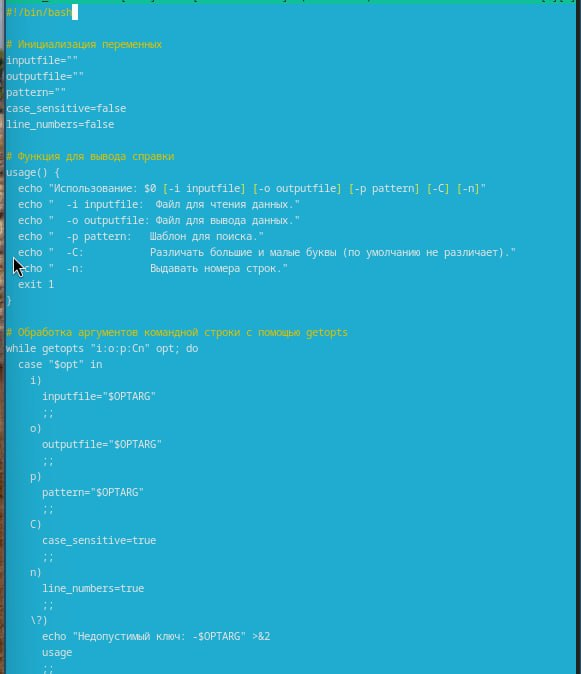
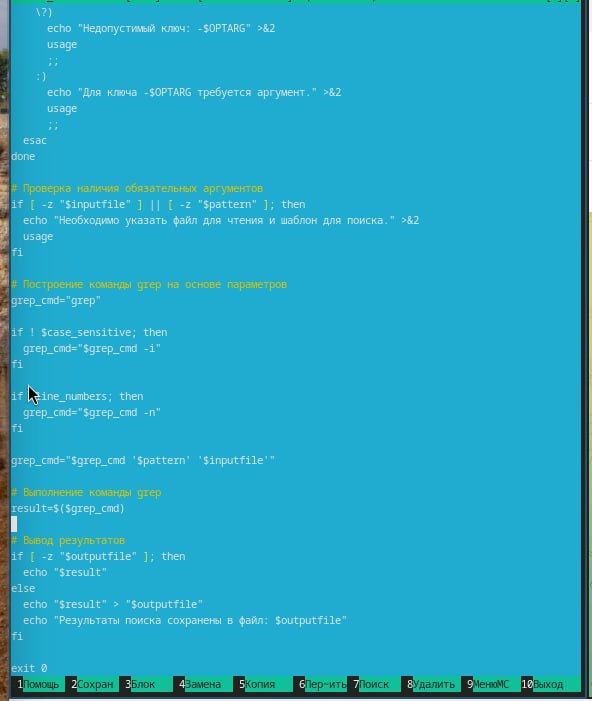
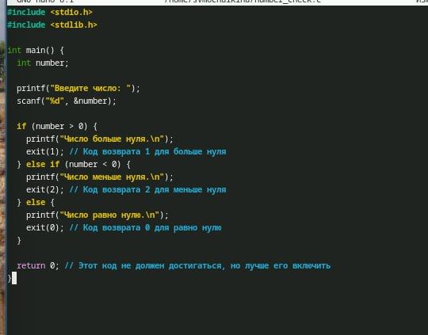
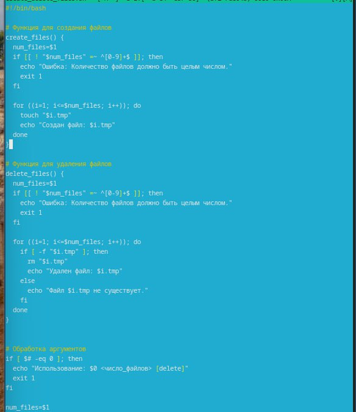
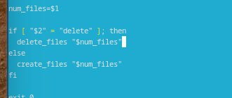
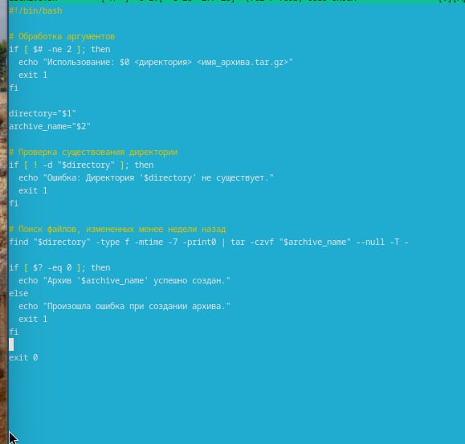

---
## Front matter
title: "Лабораторная работа 13"
subtitle: "Программирование в командном
процессоре ОС UNIX. Ветвления и циклы"
author: "Мочалкина Софья Васильевна"

## Generic otions
lang: ru-RU
toc-title: "Содержание"

## Bibliography
bibliography: bib/cite.bib
csl: pandoc/csl/gost-r-7-0-5-2008-numeric.csl

## Pdf output format
toc: true # Table of contents
toc-depth: 2
lof: true # List of figures
lot: true # List of tables
fontsize: 12pt
linestretch: 1.5
papersize: a4
documentclass: scrreprt
## I18n polyglossia
polyglossia-lang:
  name: russian
  options:
	- spelling=modern
	- babelshorthands=true
polyglossia-otherlangs:
  name: english
## I18n babel
babel-lang: russian
babel-otherlangs: english
## Fonts
mainfont: IBM Plex Serif
romanfont: IBM Plex Serif
sansfont: IBM Plex Sans
monofont: IBM Plex Mono
mathfont: STIX Two Math
mainfontoptions: Ligatures=Common,Ligatures=TeX,Scale=0.94
romanfontoptions: Ligatures=Common,Ligatures=TeX,Scale=0.94
sansfontoptions: Ligatures=Common,Ligatures=TeX,Scale=MatchLowercase,Scale=0.94
monofontoptions: Scale=MatchLowercase,Scale=0.94,FakeStretch=0.9
mathfontoptions:
## Biblatex
biblatex: true
biblio-style: "gost-numeric"
biblatexoptions:
  - parentracker=true
  - backend=biber
  - hyperref=auto
  - language=auto
  - autolang=other*
  - citestyle=gost-numeric
## Pandoc-crossref LaTeX customization
figureTitle: "Рис."
tableTitle: "Таблица"
listingTitle: "Листинг"
lofTitle: "Список иллюстраций"
lotTitle: "Список таблиц"
lolTitle: "Листинги"
## Misc options
indent: true
header-includes:
  - \usepackage{indentfirst}
  - \usepackage{float} # keep figures where there are in the text
  - \floatplacement{figure}{H} # keep figures where there are in the text
---

# Цель работы

Изучить основы программирования в оболочке ОС UNIX. Научится писать более сложные командные файлы с использованием логических управляющих конструкций и циклов.

# Задание

1)Используя команды getopts grep, написать командный файл, который анализирует
командную строку с ключами:
– -iinputfile — прочитать данные из указанного файла;
– -ooutputfile — вывести данные в указанный файл;
– -pшаблон — указать шаблон для поиска;
– -C — различать большие и малые буквы;
– -n — выдавать номера строк.
а затем ищет в указанном файле нужные строки, определяемые ключом -p.
2) Написать на языке Си программу, которая вводит число и определяет, является ли оно
больше нуля, меньше нуля или равно нулю. Затем программа завершается с помощью
функции exit(n), передавая информацию в о коде завершения в оболочку. Команд-
ный файл должен вызывать эту программу и, проанализировав с помощью команды
$?, выдать сообщение о том, какое число было введено.
3) Написать командный файл, создающий указанное число файлов, пронумерованных
последовательно от 1 до 𝑁 (например 1.tmp, 2.tmp, 3.tmp,4.tmp и т.д.). Число файлов,
которые необходимо создать, передаётся в аргументы командной строки. Этот же ко-
мандный файл должен уметь удалять все созданные им файлы (если они существуют).
4) Написать командный файл, который с помощью команды tar запаковывает в архив
все файлы в указанной директории. Модифицировать его так, чтобы запаковывались
только те файлы, которые были изменены менее недели тому назад (использовать
команду find).

# Выполнение лабораторной работы

1)

{#fig:001 width=70%}

{#fig:001 width=70%}

2)

{#fig:001 width=70%}

3)

{#fig:001 width=70%}

{#fig:001 width=70%}

4)

{#fig:001 width=70%}

Контрольные вопросы:

Ответы на вопросы:
Предназначение команды getopts:

Команда getopts предназначена для разбора аргументов командной строки в shell-скриптах (bash, sh и т.д.). Она позволяет удобно обрабатывать параметры и опции, передаваемые скрипту при его запуске. getopts особенно полезна для разбора опций, начинающихся с дефиса (-) или двойного дефиса (--), а также для обработки аргументов, требуемых этими опциями. Она упрощает написание скриптов, принимающих различные настройки через командную строку.

Отношение метасимволов к генерации имён файлов (globbing):

Метасимволы (также известные как подстановочные знаки или шаблоны) используются для генерации имён файлов (globbing) в shell. Они позволяют указывать шаблоны, которые shell раскрывает в список соответствующих файлов. Наиболее распространённые метасимволы:

*: Соответствует любому количеству символов (включая отсутствие символов). Например, *.txt соответствует всем файлам с расширением .txt.
?: Соответствует одному любому символу. Например, file?.txt соответствует file1.txt, fileA.txt, но не file12.txt.
[]: Соответствует одному символу из указанного набора. Например, file[1-3].txt соответствует file1.txt, file2.txt, file3.txt. Также можно использовать [!...] или [^...] для соответствия любому символу, не входящему в указанный набор.
Когда shell встречает метасимвол в командной строке, он пытается найти все файлы, соответствующие шаблону, и подставляет эти имена файлов в команду.

Операторы управления действиями (управления потоком выполнения):

В shell-скриптах существует несколько операторов управления действиями:

Условные операторы:

if, then, else, elif, fi: Для выполнения кода в зависимости от условия.
case, esac: Для выполнения кода в зависимости от значения переменной (похож на switch в других языках).
Циклы:

for: Для перебора элементов списка.
while: Для выполнения кода, пока условие истинно.
until: Для выполнения кода, пока условие ложно.
select: Для создания простого меню для пользователя.
Операторы группировки команд:

{ команда1; команда2; ...; }: Группирует команды, выполняемые в текущей оболочке.
( команда1; команда2; ...; ): Группирует команды, выполняемые в подоболочке.
Операторы перенаправления и конвейеры:

>, <, >>, |: Для перенаправления ввода/вывода и создания конвейеров (pipelines).
Операторы для прерывания цикла:

break: Немедленно завершает выполнение текущего цикла (for, while, until).
continue: Прерывает текущую итерацию цикла и переходит к следующей.
Предназначение команд false и true:

true: Простейшая команда, которая всегда возвращает код завершения 0 (успех). Часто используется как заглушка или для создания бесконечного цикла (например, while true; do ... done).

false: Простейшая команда, которая всегда возвращает код завершения 1 (неудача). Часто используется для принудительного выхода из условных конструкций или для явного указания ложного условия.

Значение строки if test -f man$s/$i.$s:

Эта строка является частью условной конструкции if. Она проверяет, существует ли файл с определённым именем.

test: Команда test используется для проверки различных условий (существование файла, тип файла, равенство строк, числовые сравнения и т.д.). Альтернативно можно использовать [ ... ] вместо test, но они функционально эквивалентны.
-f: Опция команды test, которая проверяет, является ли указанный путь обычным файлом. Если файл существует и является обычным файлом, test возвращает код завершения 0 (истина), иначе - 1 (ложь).
man$s/$i.$s: Предполагаемое имя файла, которое строится из переменных:
man: Вероятно, константа, указывающая на директорию man.
$s: Значение переменной s (предположительно, секция документации).
$i: Значение переменной i (предположительно, имя документации).
/: Разделитель директорий.
.: Разделитель имени файла и расширения.
Таким образом, строка проверяет, существует ли файл man<значение $s>/<значение $i>.<значение $s>. Например, если s равно 1 и i равно ls, то будет проверено существование файла man1/ls.1.
Различия между конструкциями while и until:
Обе конструкции используются для организации циклов, но отличаются условием продолжения выполнения:

while: Цикл while выполняет команды до тех пор, пока условие истинно (код завершения 0). Как только условие становится ложным (код завершения не 0), цикл завершается.

until: Цикл until выполняет команды до тех пор, пока условие ложно (код завершения не 0). Как только условие становится истинным (код завершения 0), цикл завершается.

Другими словами, until является логическим отрицанием while. Оба цикла позволяют выполнять один и тот же код, но иногда использование until делает код более читаемым и понятным, особенно если условие остановки цикла логичнее выразить как “пока не…” вместо “пока…”.

# Выводы

Я изучила основы программирования в оболочке ОС UNIX. Научилась писать более сложные командные файлы с использованием логических управляющих конструкций и циклов.
